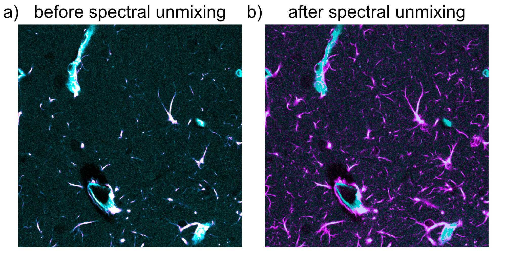
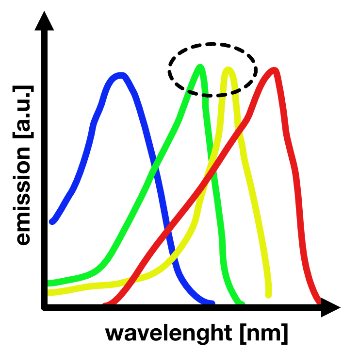

# Spectral unmixing for microscopy image stacks


`spectral-unmixing` is a small Python package focused on [spectral bleed-through correction](#what-is-bleed-through-and-why-is-it-a-problem) in microscopy stacks. It supports linear unmixing methods as well as blind unmixing methods in the PICASSO family, covering both two-channel workflows and multi-channel blind-unmixing workflows. The package is designed for multi-dimensional microscopy stacks in canonical  OME-axis-order (`TZCYX`) and can therefore handle full time-lapse z-stacks as well as simpler cases with `T=1` and/or `Z=1`. The package is designed to be used in Python scripts. We use [OMIO](https://omio.readthedocs.io/en/latest/) for reading and writing microscopy stacks, so any file format currently supported by OMIO can be processed, including TIFF-based formats, CZI, LSM, and other OMIO-readable microscopy formats.

The main goal of the project is reproducible, flexible, and effortless spectral unmixing with small, if any, requirements for user interaction. The main entry point is `spectral_unmixing.unmix(...)`, which reads a microscopy stack, estimates or uses a user-supplied bleed-through coefficient, and writes a corrected output stack along with a JSON sidecar report for reproducibility. Additional modules for filtering, registration, and projection are included as optional helpers for further image processing, but they are intentionally secondary to the unmixing workflow.


***Example of spectral unmixing in a two-channel 2D fluorescence image**. Panel a) shows the spectrally mixed input image, in which signal from the cyan channel bleeds into the magenta channel. Panel b) shows the result after correction with `spectral-unmixing` using a fixed alpha, which improves the separation of the two channels and reduces false-positive magenta signal originating from cyan bleed-through. Source image data: [figshare dataset](https://figshare.com/articles/figure/PICASSO_allows_ultra-multiplexed_fluorescence_imaging_of_spatially_overlapping_proteins_without_reference_spectra_measurements/19596682/1?file=34810114) (CC BY 4.0), from Seo, J., Sim, Y., Kim, J. et al. *PICASSO allows ultra-multiplexed fluorescence imaging of spatially overlapping proteins without reference spectra measurements*. Nature Communications 13, 2475 (2022). <https://doi.org/10.1038/s41467-022-30168-z>. The dataset is also included in the example data distributed with this package.*


## Installation
We recommend creating a dedicated Python 3.12 conda environment:

```bash
conda create -n spectral-unmixing python=3.12
conda activate spectral-unmixing
```

### Official installation from PyPI

```bash
pip install spectral-unmixing
```

### Developer installation
Clone the repository and install it in editable mode:

```bash
git clone https://github.com/FabrizioMusacchio/spectral-unmixing.git
cd spectral-unmixing
pip install -e .
```

### Upgrade
To upgrade an existing installation from PyPI:

```bash
pip install --upgrade spectral-unmixing
```

### Dependencies
Main runtime dependencies include:

- `numpy`
- `omio-microscopy`
- `scipy`
- `scikit-image`
- `pystackreg`

## What is bleed-through and why is it a problem?
In fluorescence microscopy, bleed-through (also called crosstalk or spectral spillover) occurs when signal from one fluorophore is detected in the measurement channel of another fluorophore. A common reason is spectral overlap between fluorophore emission and the selected detection windows, but the the problem also depends on the optical filters, detector settings, and the overall imaging setup.


***Schematic illustration of spectral bleed-through in fluorescence imaging setups**. Shown are four different fluorophores (blue, green, yellow, red) and their respective emission spectra as a function of wavelength. Bleed-through occurs when the emission of one fluorophore is also detected in another channel, for example when green emission is partially recorded in the yellow channel. This can happen if detection windows are not cleanly separated, if the selected detection range is too broad, or if the emission peaks of two fluorophores lie too close together. Source: [fabriziomusacchio.com](https://www.fabriziomusacchio.com/teaching/teaching_bioimage_analysis/09_napari_bleach_correction) (license: CC BY-NC-SA 4.0)*

Biologically and analytically, this is a problem because it can create false-positive signal, inflate apparent [colocalization](https://cellcoloc.readthedocs.io/en/latest/), distort intensity measurements, and ultimately bias the interpretation of cellular structures or dynamics. In practice, one may incorrectly conclude that a structure is present in a given channel even though part of the observed signal actually originates from another fluorophore.

Spectral unmixing aims to correct for this contamination by estimating the contribution of one channel to another channel and subtracting it out, thereby recovering a better approximation of the true signal of interest. In the present package, the core correction models are linear, and the blind-unmixing workflow estimates linear mixing relationships directly from the measured data.

## Spectral unmixing model
The implemented correction assumes that one channel contributes linearly to another channel:

$$
I_{\text{source}} \approx S
$$

$$
I_{\text{target}} \approx T + \alpha \, S
$$

Here,

- $I_{\text{source}}$ is the measured intensity in the source channel
- $I_{\text{target}}$ is the measured intensity in the target channel
- $S$ is the true source-channel signal
- $T$ is the true target-channel signal
- $\alpha$ is the bleed-through coefficient from source into target

Under this model, the source channel contaminates the target channel linearly.
The actual unmixing step therefore subtracts the estimated source contribution
from the measured target signal:

$$
I_{\text{target, corrected}}^{\ast}
= I_{\text{target}} - \alpha \, I_{\text{source}}
$$

This is the core linear spectral unmixing equation.

In practice, the subtraction can produce negative values in pixels or voxels
where the estimated bleed-through contribution is slightly larger than the
measured target intensity. Since negative intensities are not physically
meaningful for the final corrected image, the pipeline can optionally apply a
second, purely post-processing step:

$$
I_{\text{target, corrected}}
= \max\!\left(
I_{\text{target}} - \alpha \, I_{\text{source}},
0
\right)
$$

So these are not two different models. They are two consecutive steps:

1. linear unmixing by subtraction
2. optional clipping of negative values to zero

Only the chosen target channel is corrected. The source channel is left
unchanged.

### Optional bidirectional unmixing
For some imaging setups, bleed-through can occur in both directions. The
package therefore optionally supports bidirectional two-channel unmixing via

```python
bidirectional=True
```

In that case, the model becomes

$$
I_0 = S_0 + \alpha_{10} S_1
$$

$$
I_1 = S_1 + \alpha_{01} S_0
$$

where

- $\alpha_{01}$ denotes bleed-through from channel $0$ into channel $1$
- $\alpha_{10}$ denotes bleed-through from channel $1$ into channel $0$

This can be written in matrix form as

$$\begin{pmatrix}
I_0 \\
I_1
\end{pmatrix} =
\begin{pmatrix}
1 & \alpha_{10} \\
\alpha_{01} & 1
\end{pmatrix}
\begin{pmatrix}
S_0 \\
S_1
\end{pmatrix}.$$

The unmixed signals are then obtained by inverting this 2x2 mixing matrix:

$$\begin{pmatrix}
S_0 \\
S_1
\end{pmatrix} =
\begin{pmatrix}
1 & \alpha_{10} \\
\alpha_{01} & 1
\end{pmatrix}^{-1}
\begin{pmatrix}
I_0 \\
I_1
\end{pmatrix}.$$

Equivalently,

$$
S_0 = \frac{I_0 - \alpha_{10} I_1}{1 - \alpha_{01}\alpha_{10}}
$$

and

$$
S_1 = \frac{I_1 - \alpha_{01} I_0}{1 - \alpha_{01}\alpha_{10}}.
$$

This is preferable to sequential subtraction, because sequentially subtracting
one mixed channel from the other would depend on the update order.

## Core unmixing function
The main entry point is `spectral_unmixing.unmix(...)`.

```python
from spectral_unmixing import unmix

output_path = unmix(
    input_path="input.tif",
    output_path="unmixed/input_unmixed_reference_t0.tif",
    alpha_mode="reference_t",
    alpha_reference_t=0,
    source_channel=0,
    target_channel=1,
    signal_percentile=99.0,
)
```

`unmix(...)` performs the following steps:

- reads the input stack with [OMIO](https://omio.readthedocs.io/en/latest/)
- validates that the image is in canonical `TZCYX` order
- obtains `alpha` either as a fixed value or by estimation from the data
- optionally obtains a reverse-direction coefficient for bidirectional
  unmixing
- applies either the one-direction subtraction model or the bidirectional 2x2
  mixing-model inversion over all `T` and `Z`
- clips negative corrected values to zero if requested
- writes the corrected output stack via [OMIO](https://omio.readthedocs.io/en/latest/), typically as TIFF or OME-TIFF
- writes a JSON sidecar report next to the output file for reproducibility

The function returns the path to the written output file.

When `bidirectional=False` (default), the classic one-direction model is used.
When `bidirectional=True`, the reverse-direction settings are taken from the
optional `*_reverse` arguments. For every reverse parameter that is left at
`None`, the corresponding forward value is reused.

### Alpha modes
Three explicit `alpha_mode` values are available:

- `fixed`
  Use a user-provided scalar `alpha` for the full stack.
- `reference_t`
  Estimate one scalar `alpha` from a chosen reference time point, using all z-slices at that time point.
- `per_t`
  Estimate one `alpha` value per time point, again using all z-slices for each time point.

In addition, `alpha_mode=None` is the default. In that case:

- if `alpha` is provided, the pipeline behaves as `alpha_mode="fixed"`
- if `alpha` is not provided and `method="manual"`, a clear error is raised
- otherwise the pipeline defaults to `alpha_mode="reference_t"` with `alpha_reference_t=0`

This default works for both `T=1` and `T>1` stacks.

These modes answer the question:

> From which part of a multi-time-point dataset should the coefficient be obtained?

They do **not** determine how the coefficient is computed numerically. This can still be controlled with the `method` argument (see below).

In bidirectional mode, the same `alpha_mode` is applied independently to the forward and reverse directions.

### Alpha estimation methods
`method` controls how `alpha` is estimated once the relevant source and target volumes have been chosen by `alpha_mode`.

Available methods are:

- `manual`
  Use a user-provided `alpha`. This is only meaningful for
  an effective `alpha_mode="fixed"`.
- `mean_ratio`
  Estimate `alpha` as the ratio of mean target and source intensities inside a
  bright-source mask.
- `linear_fit`
  Estimate `alpha` by masked least-squares fitting without intercept.
- `corr_min`
  Estimate `alpha` by minimizing the correlation between the source channel and
  the corrected target channel.
- `mi_min`
  Estimate `alpha` by minimizing the mutual information between the source
  channel and the corrected target channel.

So the logic is:

- `alpha_mode` decides **where** alpha is estimated from
- `method` decides **how** alpha is estimated

For bidirectional unmixing, `method_reverse` can optionally be supplied. If it
is left as `None`, the forward `method` is reused for the reverse direction.

The same inheritance rule applies to:

- `alpha_reverse`
- `signal_percentile_reverse`
- `background_percentile_reverse`
- `target_low_percentile_reverse`
- `alpha_max_reverse`
- `mi_bins_reverse`

The default estimation method is `mean_ratio`:

```python
method="mean_ratio"
```

#### Shared alpha-estimation preprocessing
The helper `spectral_unmixing.prepare_source_target_for_alpha(...)` implements a
shared optional preprocessing step for alpha estimation.

If `preprocess_alpha_inputs=True`, it:

- converts inputs to `float32`
- subtracts a low-percentile background estimate from both channels
- clips negative values to zero

Mathematically, if the raw source and target volumes are denoted by
$X_{\mathrm{raw}}$ and $Y_{\mathrm{raw}}$, the preprocessing step computes background estimates

$$b_X = \mathrm{percentile}(X_{\mathrm{raw}}, p_{\mathrm{bg}})$$

and

$$b_Y = \mathrm{percentile}(Y_{\mathrm{raw}}, p_{\mathrm{bg}})$$

and then forms

$$
X = \max(X_{\mathrm{raw}} - b_X, 0)
$$

$$
Y = \max(Y_{\mathrm{raw}} - b_Y, 0)
$$

where $p_{\mathrm{bg}}$ is the chosen `background_percentile`.

This preprocessing is used only for **estimating** `alpha`. The final image
correction is still applied to the measured working array inside the unmixing
pipeline.

#### Shared alpha mask
The helper `spectral_unmixing.make_alpha_mask(...)` creates the voxel mask used
for alpha estimation.

By default, the mask is defined from bright source voxels:

$$\mathcal{M}= \{\, i \mid X_i \ge \mathrm{percentile}(X, p_{\mathrm{sig}}) \,\}$$

where $p_{\mathrm{sig}}$ is `signal_percentile`.

Optionally, the mask can be restricted further to voxels with comparatively low target intensity:

$$\mathcal{M} = \mathcal{M} \cap \{\, i \mid Y_i \le \mathrm{percentile}(Y, p_{\mathrm{target,low}}) \,\}$$

where $p_{\mathrm{target,low}}$ is `target_low_percentile`.

This can be useful when one wants to estimate bleed-through primarily from voxels with strong source signal but as little genuine target signal as possible.

If this stricter mask becomes too small, the implementation falls back to the source-only mask when possible and records that behavior in the JSON report.

#### Method: `manual`
For `method="manual"`, no coefficient is estimated from the data.

The user supplies

$$
\alpha \ge 0
$$

directly, and the correction uses that fixed value.

This is the scientifically preferred mode when `alpha` has been determined from
a suitable single-label control measurement acquired with the same imaging
settings.

In bidirectional fixed mode, one may either provide both `alpha` and
`alpha_reverse`, or provide only `alpha` and let the reverse direction inherit
that value.

#### Method: `mean_ratio`
This is the original default behavior of the package.

After preprocessing and masking, let

$$
x_i = X_i \quad \text{for } i \in \mathcal{M}
$$

and

$$
y_i = Y_i \quad \text{for } i \in \mathcal{M}.
$$

Then the estimate is

$$\hat{\alpha}_{\mathrm{mean\_ratio}} = \frac{\frac{1}{|\mathcal{M}|}\sum_{i \in \mathcal{M}} y_i} {\frac{1}{|\mathcal{M}|}\sum_{i \in \mathcal{M}} x_i}.$$

This estimator is simple and often stable, but it is not identical to a
least-squares fit.

#### Method: `linear_fit`
This method performs masked least-squares fitting **without intercept**:

$$
y_i \approx \alpha x_i \quad \text{for } i \in \mathcal{M}.
$$

The resulting estimator is

$$\hat{\alpha}_{\mathrm{linear\_fit}} = \frac{\sum_{i \in \mathcal{M}} x_i y_i} {\sum_{i \in \mathcal{M}} x_i^2}.$$

No intercept is fitted, because the optional background subtraction is already
handled during preprocessing and because an intercept would blur the
interpretation of $\alpha$ as a bleed-through coefficient.

#### Method: `corr_min`
This method chooses $\alpha$ so that the corrected target channel becomes as
uncorrelated as possible with the source channel:

$$
Y^{(\alpha)} = Y - \alpha X.
$$

The estimate is obtained by solving

$$\hat{\alpha}_{\mathrm{corr\_min}} = \arg\min_{0 \le \alpha \le \alpha_{\max}} \mathrm{corr}(X, Y^{(\alpha)})^2.$$

In practice, the implementation uses Pearson correlation and bounded scalar optimization on the interval $[0, \alpha_{\max}]$.

This can be more aggressive than `mean_ratio` or `linear_fit`, especially when
the true biology in source and target channels is itself correlated.

#### Method: `mi_min`
This method follows the two-channel version of the PICASSO idea: choose
$\alpha$ such that the statistical dependence between source and corrected
target becomes minimal.

Again define

$$
Y^{(\alpha)} = Y - \alpha X.
$$

Then the estimate is obtained from

$$\hat{\alpha}_{\mathrm{mi\_min}} = \arg\min_{0 \le \alpha \le \alpha_{\max}} \mathrm{MI}(X, Y^{(\alpha)}),$$

where $\mathrm{MI}$ denotes mutual information. The current
implementation uses a histogram-based mutual-information estimate with a user
controlled number of bins `mi_bins`.

The two-channel `mi_min` method is inspired by the PICASSO criterion, but it is
**not** the full multi-channel PICASSO algorithm.

### Multi-channel PICASSO-family blind unmixing
The package additionally provides a separate function:

```python
from spectral_unmixing import unmix_picasso
```

The PICASSO-family workflows implemented here are motivated by the original
PICASSO publication:

> Seo, J., Sim, Y., Kim, J. et al. *PICASSO allows ultra-multiplexed
> fluorescence imaging of spatially overlapping proteins without reference
> spectra measurements*. Nature Communications 13, 2475 (2022).
> https://doi.org/10.1038/s41467-022-30168-z

This function is separate from the simpler two-channel `unmix(...)` workflow
and is meant for blind multi-channel unmixing under the assumption that:

- the number of measured channels equals the number of fluorophores
- the mixture is approximately linear
- one wants to reduce cross-channel dependence without supplying an external
  reference spectrum matrix

The underlying linear model is

$$
I = M F,
$$

where

- $I$ is the vector of measured channels
- $F$ is the vector of latent fluorophore signals
- $M$ is an unknown mixing matrix.

`unmix_picasso(...)` now supports three implementation modes:

- `implementation="matlab_3c"`:
  Default. A close Python port of the original MATLAB PICASSO 3-channel code.
  This mode intentionally requires exactly three selected channels.
- `implementation="matlab_n"`:
  An explicit N-channel generalization of the MATLAB 3-channel workflow. It
  keeps the same iterative logic, but applies it to an arbitrary number of
  selected channels.
- `implementation="source_sink_n"`:
  A source-sink N-channel workflow inspired by the napari PICASSO plugin. This
  mode lets the user specify which channels can bleed into which sinks through a
  `source_sink_matrix`, or more simply through `sink_channels` and
  `neutral_channels`.

#### `matlab_3c`: close port of the original MATLAB algorithm
In the original MATLAB-style workflow, the current channel vector
$\mathbf{v}^{(k)}$ is updated iteratively:

$$
\mathbf{v}^{(k+1)} = C^{(k)} \mathbf{v}^{(k)},
$$

where the incremental update matrix is

$$
C^{(k)} = I + s A^{(k)}.
$$

Here:

- $I$ is the identity matrix
- $s$ is the user-controlled `step_size`
- $A^{(k)}$ is a matrix of pairwise subtraction coefficients

For each ordered channel pair $(i, j)$, the MATLAB-style routine estimates a
scalar $\alpha_{ij}$ by minimizing histogram-based mutual information after
subtracting one channel from the other:

$$\alpha_{ij}= \arg\min_{\alpha} \mathrm{MI}\!\left(v_i - \alpha v_j,\; v_j\right).$$

The off-diagonal entries of $A^{(k)}$ are then

$$A^{(k)}_{ij} = -\alpha_{ij} \quad (i \neq j).$$

The Python port follows the MATLAB routine closely, including:

- per-channel max normalization before estimation
- low-percentile background subtraction
- 2D pixel binning before MI estimation
- coefficient clipping with `alpha_clip`
- the MATLAB-style negativity check and occasional positivity enforcement

#### `matlab_n`: explicit N-channel generalization
The `matlab_n` mode keeps the same pairwise-update idea, but extends it from
three channels to $N$ selected channels:

$$\mathbf{v}^{(k+1)} = C^{(k)} \mathbf{v}^{(k)}, \quad C^{(k)} = I + s A^{(k)},$$

with pairwise coefficients estimated for all ordered channel pairs
$(i, j)$, $i \neq j$.

Conceptually, this is a pragmatic extension of the MATLAB algorithm. It is not
claimed to be the original PICASSO publication's exact N-channel method,
because the published MATLAB code itself is specialized to three channels.

#### `source_sink_n`: explicit source-sink modeling
The `source_sink_n` mode uses a more direct formulation. For each sink channel
$j$, the corrected sink is modeled as

$$\tilde{I}_j = I_j - \sum_{i \in \mathcal{S}_j} \alpha_{ij} \, S_i,$$

where:

- $\mathcal{S}_j$ is the set of source channels allowed to contribute to sink
  $j$
- the allowed source-sink relations are encoded in `source_sink_matrix`
- $S_i$ is a prepared source image for channel $i$

For users who do not want to write the full matrix manually, the same relation
graph can be built more readably from channel-role lists:

- `sink_channels=[...]`:
  selected channels that should be corrected as sinks
- `neutral_channels=[...]`:
  selected channels that should remain neutral, meaning they are neither
  corrected as sinks nor used as sources

In that convenience mode, all selected non-neutral channels are allowed to
bleed into all specified sink channels except into themselves.

Each coefficient is estimated by minimizing mutual information:

$$
\alpha_{ij} = \arg\min_{0 \le \alpha \le \alpha_{\max}} \mathrm{MI}\!\left(S_i,\; I_j - \alpha S_i\right).
$$

This mode is inspired by the napari plugin's source-sink viewpoint, but it is
not a neural or MINE-based reimplementation of that plugin.

#### `alpha_mode` inside `unmix_picasso(...)`
As in the two-channel workflow, `alpha_mode` controls *where* the coefficients
or update sequence are estimated from:

- `alpha_mode="reference_t"`:
  estimate once from `alpha_reference_t` and apply the learned parameters to all
  time points
- `alpha_mode="per_t"`:
  estimate a separate blind-unmixing solution for each time point

For practical examples, see:

- [user_scripts/unmix_picasso_5color_simulation.py](/Users/husker/Science/Python/Projekte/Spectral%20Unmixing/user_scripts/unmix_picasso_5color_simulation.py)

### Output and reproducibility
Each unmixing run writes a JSON sidecar report next to the output stack, for
example:

```text
input_unmixed_reference_t0.tif.json
```

This report stores the main processing settings such as alpha mode, estimated
alpha values, reverse-direction settings when bidirectional unmixing is used,
source and target channels, axis order, and output dtype.

Terminal progress output is enabled by default and can be disabled with
`verbose=False`.

### Scientific Note
A fixed `alpha` measured from a proper single-label control recording is scientifically preferable.

Estimating `alpha` from the mixed experimental stack is available as a pragmatic first-pass workflow, but it can be biased when source and target biology overlap spatially.

`alpha_mode="reference_t"` assumes that the bleed-through factor is stable across time.

`alpha_mode="per_t"` can compensate for slow intensity changes, but may also introduce time-dependent artifacts when biology changes over time.

## Add-ons: Filtering, registration, and projection
In addition to spectral unmixing, the package also includes optional helper
functions for:

- filtering: `apply_filters(...)`
- time-wise histogram matching: `match_histograms_across_time(...)`
- max-z projection: `max_z_project(...)`
- intra-stack z-drift correction: `correct_intra_stack_z_drift(...)`
- time registration: `register_stack(...)`

These helper modules are meant to support follow-up image processing after unmixing. They are not the primary focus of the project, and their full documentation will be expanded later in Read the Docs.

For now, see the tutorial-style user scripts provided in the `user_scripts` folder for practical examples of how to use these add-ons.

## Citation
If you use *Spectral Unmixing* in scientific work, please cite:

> Musacchio, F. (2026). *Spectral Unmixing: A Python package for linear spectral unmixing in microscopy images*. Zenodo. https://doi.org/10.5281/zenodo.20933784
