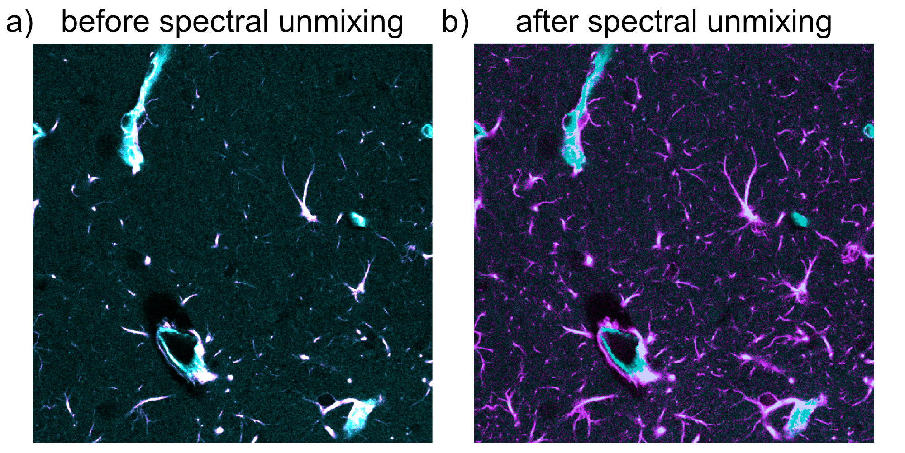

Overview
========

`spectral-unmixing` is a Python package for linear spectral unmixing in
fluorescence microscopy images. It provides workflows for directed linear
unmixing and PICASSO-family blind unmixing, along with optional post-unmixing 
helpers for filtering, projection, registration, and napari visualization.
It's main purpose is to provide a simple, scriptable, and reproducible solution 
for spectral bleed-through correction in multi-dimensional microscopy stacks.

What is bleed-through and why is it a problem?
----------------------------------------------

In fluorescence microscopy, bleed-through, also called crosstalk or spectral
spillover, occurs when signal from one fluorophore is detected in the
measurement channel of another fluorophore. A common reason is spectral overlap
between fluorophore emission and the selected detection windows, but the
problem also depends on the optical filters, detector settings, and the
overall imaging setup.

.. figure:: _static/blead_throug_1600px.png
   :alt: Schematic illustration of spectral bleed-through
   :align: center
   :figwidth: 70%

   **Figure 1.** Schematic illustration of spectral bleed-through in
   fluorescence imaging setups. Shown are four different fluorophores (blue,
   green, yellow, red) and their respective emission spectra as a function of
   wavelength. Bleed-through occurs when the emission of one fluorophore is
   also detected in another channel, for example when green emission is
   partially recorded in the yellow channel. This can happen if detection
   windows are not cleanly separated, if the selected detection range is too
   broad, or if the emission peaks of two fluorophores lie too close together.
   Source:
   `fabriziomusacchio.com <https://www.fabriziomusacchio.com/teaching/teaching_bioimage_analysis/09_napari_bleach_correction>`_
   (license: CC BY-NC-SA 4.0)

Biologically and analytically, this is a problem because it can create
false-positive signal, inflate apparent colocalization, distort intensity
measurements, and ultimately bias the interpretation of cellular structures or
dynamics. In practice, one may incorrectly conclude that a structure is present
in a given channel even though part of the observed signal actually originates
from another fluorophore.

Spectral unmixing aims to correct for this contamination by estimating the
contribution of one channel to another channel and subtracting it out, thereby
recovering a better approximation of the true signal of interest. In this
package, the core correction models are linear, and the blind-unmixing
workflow estimates linear mixing relationships directly from the measured data.

What the package does
---------------------

``spectral-unmixing`` focuses on spectral bleed-through correction in
multi-dimensional microscopy stacks. It supports:

- linear two-channel unmixing via ``unmix(...)``
- optional bidirectional two-channel correction via inversion of a 2x2 linear
  mixing model
- multiple alpha-estimation strategies for linear unmixing
- PICASSO-family blind unmixing via ``unmix_picasso(...)``
- optional follow-up helpers for filtering, projection, registration, and
  napari visualization

   **Figure 2.** Example of spectral unmixing in a two-channel 2D fluorescence
   image. Panel **a)** shows the spectrally mixed input image, in which signal
   from the cyan channel bleeds into the magenta channel. Panel **b)** shows
   the result after correction with ``spectral-unmixing`` using a fixed alpha,
   which improves the separation of the two channels and reduces false-positive
   magenta signal originating from cyan bleed-through. Source image data:
   `figshare dataset <https://figshare.com/articles/figure/PICASSO_allows_ultra-multiplexed_fluorescence_imaging_of_spatially_overlapping_proteins_without_reference_spectra_measurements/19596682/1?file=34810114>`_
   (CC BY 4.0), from Seo, J., Sim, Y., Kim, J. et al. *PICASSO allows
   ultra-multiplexed fluorescence imaging of spatially overlapping proteins
   without reference spectra measurements*. Nature Communications 13, 2475
   (2022). https://doi.org/10.1038/s41467-022-30168-z.

Stack model and file formats
----------------------------

The package assumes that OMIO returns stacks in canonical ``TZCYX`` order:

- ``T``: time
- ``Z``: z-plane
- ``C``: channel
- ``Y``: image height
- ``X``: image width

This means the workflows support:

- full time-lapse z-stacks,
- single-time-point 3D stacks,
- 2D multi-channel images with ``Z=1``,
- and mixed cases such as ``T>1, Z=1``.

Input is intentionally format-agnostic on the package side. Any microscopy file
format currently supported by `OMIO <https://omio.readthedocs.io/en/latest/>`_
can be used as input. Output stacks are written back through OMIO, typically as
TIFF or OME-TIFF.

Spectral unmixing model
-----------------------

The implemented correction assumes that one channel contributes linearly to
another channel:

.. math::

   I_{\mathrm{source}} \approx S

.. math::

   I_{\mathrm{target}} \approx T + \alpha S

Here:

- :math:`I_{\mathrm{source}}` is the measured intensity in the source channel
- :math:`I_{\mathrm{target}}` is the measured intensity in the target channel
- :math:`S` is the true source-channel signal
- :math:`T` is the true target-channel signal
- :math:`\alpha` is the bleed-through coefficient from source into target

Under this model, the source channel contaminates the target channel linearly.
The actual unmixing step therefore subtracts the estimated source contribution
from the measured target signal:

.. math::

   I_{\mathrm{target, corrected}}^{\ast}
   =
   I_{\mathrm{target}} - \alpha I_{\mathrm{source}}

This is the core linear spectral unmixing equation.

In practice, the subtraction can produce negative values in pixels or voxels
where the estimated bleed-through contribution is slightly larger than the
measured target intensity. Since negative intensities are not physically
meaningful for the final corrected image, the pipeline can optionally apply a
second, purely post-processing step:

.. math::

   I_{\mathrm{target, corrected}}
   =
   \max \left(
   I_{\mathrm{target}} - \alpha I_{\mathrm{source}},
   0
   \right)

So these are not two different models. They are two consecutive steps:

1. linear unmixing by subtraction
2. optional clipping of negative values to zero

Only the chosen target channel is corrected. The source channel is left
unchanged.

This is a linear unmixing workflow. The package does not implement a nonlinear
unmixing model.

Optional bidirectional unmixing
-------------------------------

For some imaging setups, bleed-through can occur in both directions. The
package therefore optionally supports bidirectional two-channel unmixing via
``bidirectional=True``.

In that case, the model becomes:

.. math::

   I_0 = S_0 + \alpha_{10} S_1

.. math::

   I_1 = S_1 + \alpha_{01} S_0

where:

- :math:`\alpha_{01}` denotes bleed-through from channel :math:`0` into
  channel :math:`1`
- :math:`\alpha_{10}` denotes bleed-through from channel :math:`1` into
  channel :math:`0`

This can be written in matrix form as:

.. math::

   \begin{pmatrix}
   I_0 \\
   I_1
   \end{pmatrix}
   =
   \begin{pmatrix}
   1 & \alpha_{10} \\
   \alpha_{01} & 1
   \end{pmatrix}
   \begin{pmatrix}
   S_0 \\
   S_1
   \end{pmatrix}

The unmixed signals are then obtained by inverting this :math:`2 \times 2`
mixing matrix:

.. math::

   \begin{pmatrix}
   S_0 \\
   S_1
   \end{pmatrix}
   =
   \begin{pmatrix}
   1 & \alpha_{10} \\
   \alpha_{01} & 1
   \end{pmatrix}^{-1}
   \begin{pmatrix}
   I_0 \\
   I_1
   \end{pmatrix}

Equivalently:

.. math::

   S_0 = \frac{I_0 - \alpha_{10} I_1}{1 - \alpha_{01}\alpha_{10}}

.. math::

   S_1 = \frac{I_1 - \alpha_{01} I_0}{1 - \alpha_{01}\alpha_{10}}

This is preferable to sequential subtraction, because sequentially subtracting
one mixed channel from the other would depend on the update order.

Blind unmixing in the PICASSO family
------------------------------------

In addition to direct linear correction, the package provides
``unmix_picasso(...)`` for PICASSO-family blind unmixing, motivated by the original
PICASSO publication:

   Seo, J., Sim, Y., Kim, J. et al. *PICASSO allows ultra-multiplexed
   fluorescence imaging of spatially overlapping proteins without reference
   spectra measurements*. Nature Communications 13, 2475 (2022).
   https://doi.org/10.1038/s41467-022-30168-z

In this context, "blind" means that mixing relations are estimated from 
the measured data rather than supplied as fixed reference spectra.

Three implementation paths are available:

- ``matlab_3c``:
  a close Python port of the original MATLAB 3-channel PICASSO workflow
- ``matlab_n``:
  an explicit N-channel generalization of that 3-channel workflow
- ``source_sink_n``:
  a source-sink formulation in which selected channels are corrected as sinks
  from one or more modeled source channels

These workflows still use linear channel-mixing assumptions. What differs is
how the mixing coefficients are inferred.

The underlying linear model is:

.. math::

   I = M F

where:

- :math:`I` is the vector of measured channels
- :math:`F` is the vector of latent fluorophore signals
- :math:`M` is an unknown mixing matrix

The blind-unmixing goal is to infer an unmixing transform from the data
without supplying an external reference-spectrum matrix.

``matlab_3c``: close port of the original MATLAB algorithm
~~~~~~~~~~~~~~~~~~~~~~~~~~~~~~~~~~~~~~~~~~~~~~~~~~~~~~~~~~

In the original MATLAB-style workflow, the current channel vector
:math:`\mathbf{v}^{(k)}` is updated iteratively:

.. math::

   \mathbf{v}^{(k+1)} = C^{(k)} \mathbf{v}^{(k)}

where the incremental update matrix is:

.. math::

   C^{(k)} = I + s A^{(k)}

Here:

- :math:`I` is the identity matrix
- :math:`s` is the user-controlled ``step_size``
- :math:`A^{(k)}` is a matrix of pairwise subtraction coefficients

For each ordered channel pair :math:`(i, j)`, the MATLAB-style routine
estimates a scalar :math:`\alpha_{ij}` by minimizing histogram-based mutual
information after subtracting one channel from the other:

.. math::

   \alpha_{ij}
   =
   \arg\min_{\alpha}
   \mathrm{MI}\!\left(v_i - \alpha v_j,\; v_j\right)

The off-diagonal entries of :math:`A^{(k)}` are then:

.. math::

   A^{(k)}_{ij} = -\alpha_{ij} \quad (i \neq j)

The Python port follows the MATLAB routine closely, including:

- per-channel max normalization before estimation
- low-percentile background subtraction
- 2D pixel binning before mutual-information estimation
- coefficient clipping with ``alpha_clip``
- MATLAB-style negativity checks and optional positivity enforcement

``matlab_n``: explicit N-channel generalization
~~~~~~~~~~~~~~~~~~~~~~~~~~~~~~~~~~~~~~~~~~~~~~~

The ``matlab_n`` mode keeps the same pairwise-update idea, but extends it from
three channels to :math:`N` selected channels:

.. math::

   \mathbf{v}^{(k+1)} = C^{(k)} \mathbf{v}^{(k)},
   \quad
   C^{(k)} = I + s A^{(k)}

with pairwise coefficients estimated for all ordered channel pairs
:math:`(i, j)`, :math:`i \neq j`.

Conceptually, this is a pragmatic extension of the MATLAB algorithm. It is not
claimed to be the original PICASSO publication's exact N-channel method,
because the published MATLAB code itself is specialized to three channels.

``source_sink_n``: explicit source-sink modeling
~~~~~~~~~~~~~~~~~~~~~~~~~~~~~~~~~~~~~~~~~~~~~~~~

The ``source_sink_n`` mode uses a more direct formulation. For each sink
channel :math:`j`, the corrected sink is modeled as:

.. math::

   \tilde{I}_j = I_j - \sum_{i \in \mathcal{S}_j} \alpha_{ij} S_i

where:

- :math:`\mathcal{S}_j` is the set of source channels allowed to contribute to
  sink :math:`j`
- the allowed source-sink relations are encoded in
  ``source_sink_matrix``
- :math:`S_i` is a prepared source image for channel :math:`i`

For users who do not want to write the full matrix manually, the same relation
graph can be built more readably from channel-role lists:

- ``sink_channels=[...]``:
  selected channels that should be corrected as sinks
- ``neutral_channels=[...]``:
  selected channels that should remain neutral, meaning they are neither
  corrected as sinks nor used as sources

In that convenience mode, all selected non-neutral channels are allowed to
bleed into all specified sink channels except into themselves.

Each coefficient is estimated by minimizing mutual information:

.. math::

   \alpha_{ij}
   =
   \arg\min_{0 \le \alpha \le \alpha_{\max}}
   \mathrm{MI}\!\left(S_i,\; I_j - \alpha S_i\right)

This mode is inspired by the napari plugin's source-sink viewpoint, but it is
not a neural or MINE-based reimplementation of that plugin.

Optional helper modules
-----------------------

The package also includes secondary helper functionality for post-unmixing
processing:

- ``apply_filters(...)``:
  median and Gaussian filtering for canonical ``TZCYX`` stacks
- ``match_histograms_across_time(...)``:
  time-wise histogram matching against the first time point
- ``max_z_project(...)``:
  z-projection while preserving ``T`` and ``C``
- ``register_stack(...)``:
  time registration using either ``pystackreg`` or
  ``phase_cross_correlation``
- ``correct_intra_stack_z_drift(...)``:
  optional within-stack z-drift correction
- ``show_unmixed_channels_in_napari(...)`` and
  ``show_all_channels_in_napari(...)``:
  reusable napari inspection helpers

The current documentation focuses primarily on the unmixing workflows. The
filtering and registration modules are already available and are summarized in
the usage documentation, but their dedicated tutorial pages can be expanded
later.

Reproducibility
---------------

Every unmixing run writes a JSON sidecar report next to the output stack. This
report stores the parameters used for the run, including the selected mode,
channel assignments, estimated coefficients, and implementation settings. This
makes the package suitable for transparent, script-based microscopy workflows.

License
-------

``spectral-unmixing`` is released under the GNU General Public License v3.0 or
later (GPL-3.0-or-later). See the repository's ``LICENSE`` file for the full
license text.

Citation
--------

If you use *Spectral Unmixing* in scientific work, please cite:

   Musacchio, F. (2026). *Spectral Unmixing: A Python package for linear
   spectral unmixing in microscopy images*. Zenodo.
   https://doi.org/10.5281/zenodo.20933784

Where to start
--------------

If you are new to the package, a good reading order is:

1. :doc:`installation`
2. :doc:`usage_functionality_overview`
3. :doc:`usage_unmix_example`
4. the more specialized tutorial pages in :doc:`usage`
