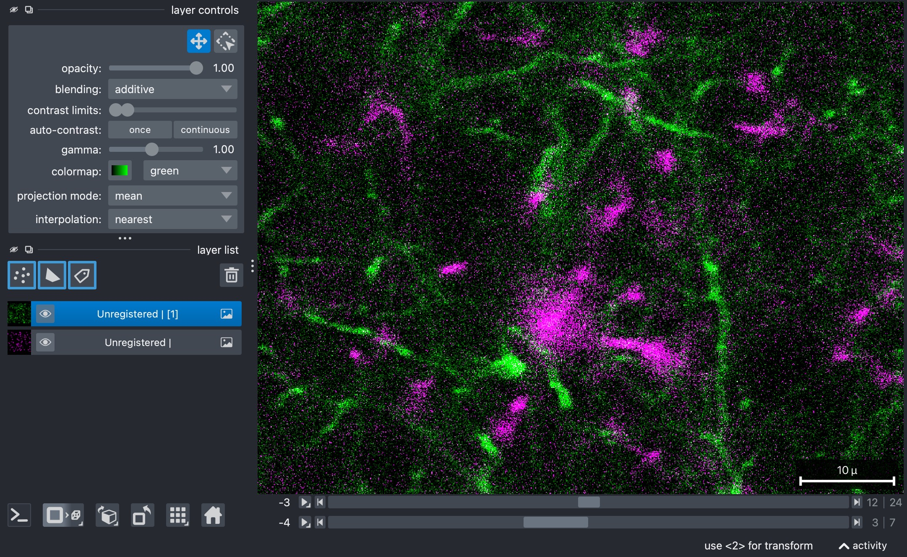
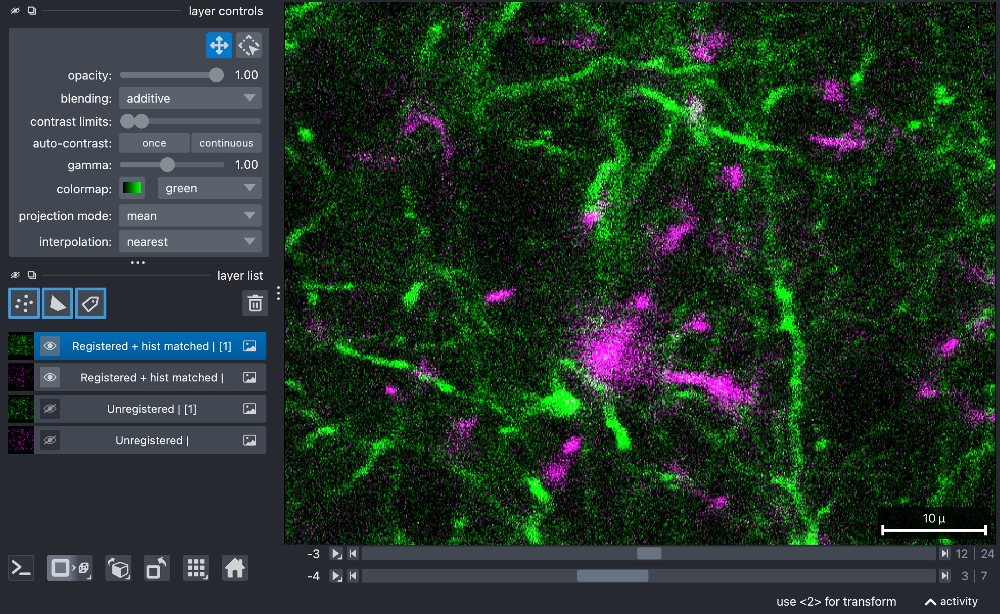
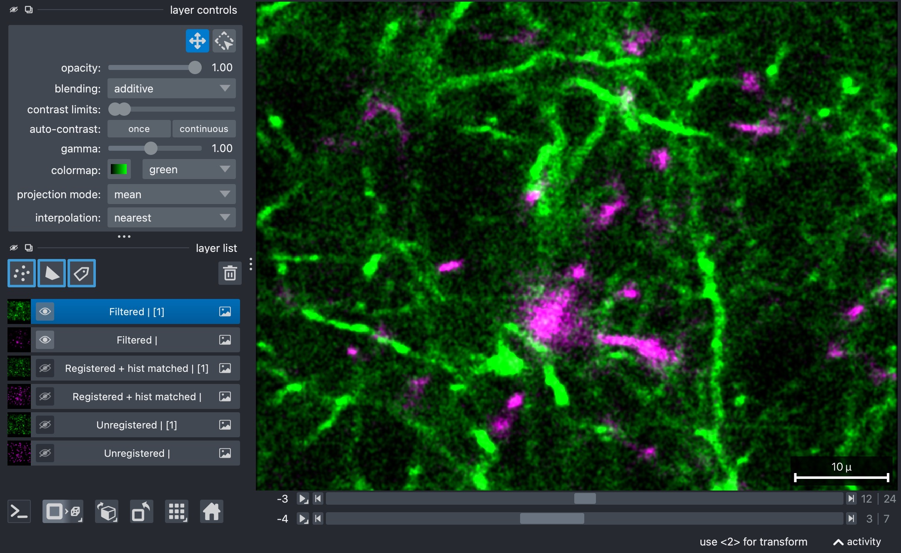
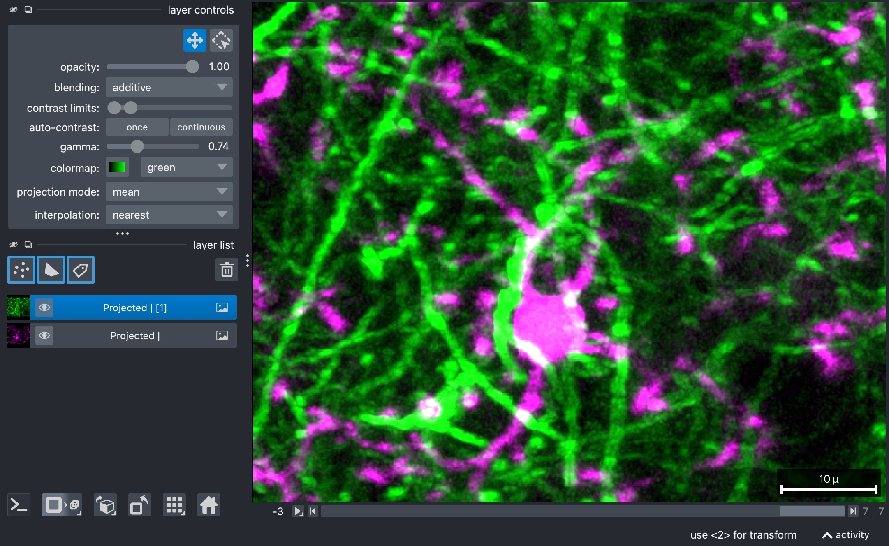
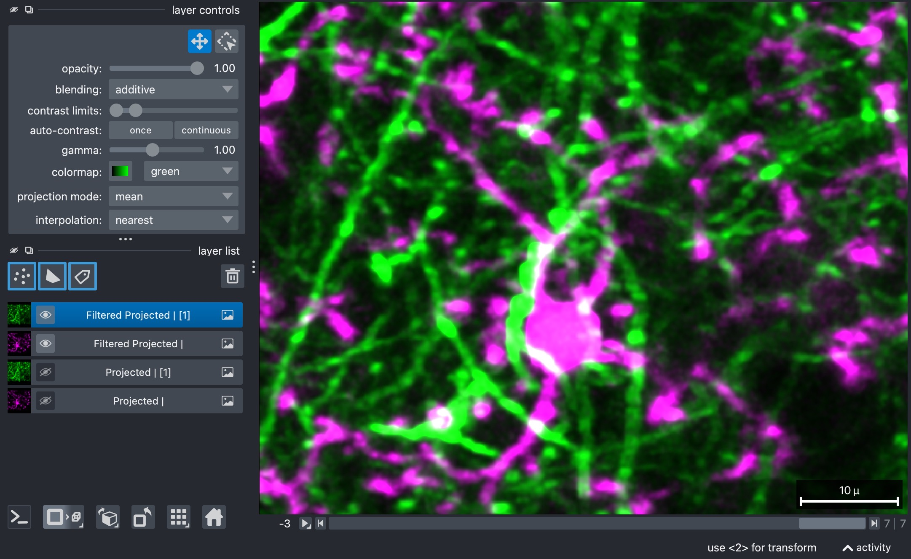

Filtering, registration, and projection helper example
=======================================================

Unlike the unmixing tutorials, this page focuses on the optional helper
functions that are useful *after* spectral unmixing has already been performed.
The script demonstrates a practical post-processing workflow for a canonical
``TZCYX`` stack:

- loading the stack with `OMIO <https://omio.readthedocs.io/en/latest/>`_,
- correcting intra-stack z-drift,
- registering the stack across time,
- matching intensities across time,
- filtering before and after projection,
- projecting along z,
- and saving the final processed result.

How to use this tutorial
------------------------

All steps described in this tutorial are implemented in the Python script
``user_scripts/filter_and_register_stack.py``. The script is designed 
for interactive execution in a cell-based editor such as
VS Code's interactive window.

The recommended workflow is:

1. open ``user_scripts/filter_and_register_stack.py``,
2. run the cells from top to bottom,
3. adapt the settings that are relevant for your own dataset.

The subsections below follow the order of the script cells and explain what the
individual helper functions are doing and which settings matter most.

The script and this tutorial mimic a typical post-processing workflow for a time-lapse z-stack, 
but you can also use the individual helper functions in a different order or with different 
settings if your own dataset requires it. The main takeaway point is, that you can combine the 
package's non-unmixing modules in a flexible way to build your own post-processing pipeline,
tailored to your own data and analysis needs.

What this tutorial covers
-------------------------

This helper workflow demonstrates how the package's non-unmixing modules can be
combined in a realistic pipeline:

- `OMIO <https://omio.readthedocs.io/en/latest/>`_-based stack loading and saving,
- within-time-point z-drift correction via
  ``correct_intra_stack_z_drift(...)``,
- across-time registration via ``register_stack(...)``,
- time-wise intensity harmonization via ``match_histograms_across_time(...)``,
- filtering via ``apply_filters(...)``,
- and z-projection via ``max_z_project(...)``.

This makes the tutorial a good starting point when you already have an unmixed
stack and want to continue with structural cleanup and visualization-oriented
processing.

Imports
-------

The first cell imports the package helpers used throughout the tutorial:

.. literalinclude:: ../../user_scripts/filter_and_register_stack.py
   :language: python
   :start-after: # %% IMPORTS
   :end-before: # %% INPUT AND OUTPUT PATHS

The most important imported functions here are:

- ``load_stack_with_omio(...)`` and ``write_stack_with_omio(...)`` for I/O,
- ``correct_intra_stack_z_drift(...)`` and ``register_stack(...)`` for
  registration,
- ``apply_filters(...)``, ``match_histograms_across_time(...)``, and
  ``max_z_project(...)`` for post-processing.

Define input and output paths
-----------------------------

Next, we need to define the input stack and the output directory where the
processed result will be written:

.. literalinclude:: ../../user_scripts/filter_and_register_stack.py
   :language: python
   :start-after: # %% INPUT AND OUTPUT PATHS
   :end-before: # %% LOAD STACK WITH OMIO

What you will usually change here:

- ``INPUT_PATH`` to point to your own OMIO-readable stack,
- the output directory name,
- and the output filename pattern.

Load the stack
------------------------

The next cell loads the input stack and prints a quick shape and axis summary:

.. literalinclude:: ../../user_scripts/filter_and_register_stack.py
   :language: python
   :start-after: # %% LOAD STACK WITH OMIO
   :end-before: # %% CORRECT INTRA-STACK Z-DRIFT

This is a good early sanity check. Before any processing is applied, confirm
that the stack shape is what you expect and that the metadata report canonical
``TZCYX`` axes.

   Raw two-channel example stack (3D+t) used in this tutorial. Shown is slice z=12
   at t=3.

Correct intra-stack z-drift
---------------------------

This cell uses ``correct_intra_stack_z_drift(...)`` to compensate for z-local
motion within each time point before any across-time registration is attempted:

.. literalinclude:: ../../user_scripts/filter_and_register_stack.py
   :language: python
   :start-after: # %% CORRECT INTRA-STACK Z-DRIFT
   :end-before: # %% REGISTER STACK ACROSS TIME

The most important settings here are:

- ``registration_channel``:
  chooses which channel is treated as the structurally stable reference for
  z-drift correction. Pick the channel that contains the most reliable
  non-motile structure.
- ``method``:
  selects the registration backend; currently supported are ``"pystackreg"`` and
  ``"phase_cross_correlation"``.
- ``reference_mode``:
  determines how each z-slice is compared. ``"neighbor"`` uses a local
  neighboring-slice reference, whereas other modes such as ``"full_projection"``
  can be more global and aggressive.
- ``neighbor_window_size``:
  controls how many neighboring z-slices participate in the local reference
  when ``reference_mode="neighbor"``. Larger values make the local reference
  broader; smaller values keep it more local.
- ``pre_median_filter`` and ``post_median_filter``:
  control whether median filtering is applied before or after generating the
  registration reference images. Note: Removing noise can improve registration, 
  depending on the dataset. Filtering is applied only ti the internal reference images, 
  not to the original stack nor the final output.
- ``median_kernel_size``:
  sets the kernel size for those optional median filters.
- ``verbose``:
  enables terminal output during the correction run.

The napari calls in this cell are useful for visually comparing the original
and z-corrected stacks before continuing.

:: note

   Since the underlying example stack is already well-aligned in z, we omitted
   this step here. The same is true for the subsequently discussed registration across time.
   In practice, you will usually want to run movement corrections 
   before any further processing, since even small misalignments can affect downstream 
   interpretation and analysis.

Register the stack across time
------------------------------

Once intra-stack z-drift has been reduced, you can additionally register the corrected
stack across time:

.. literalinclude:: ../../user_scripts/filter_and_register_stack.py
   :language: python
   :start-after: # %% REGISTER STACK ACROSS TIME
   :end-before: # %% HISTOGRAM MATCH ACROSS TIME

The most relevant settings are:

- ``registration_channel``:
  same role as above, but now for across-time registration.
- ``method``:
  again selects the registration backend.
- ``zrange``:
  limits which z-slices are included in the projection used to estimate the
  time-registration shifts. This can help when only part of the z-stack
  contains the stable structure you want to align on.
- ``pre_median_filter`` and ``post_median_filter``:
  optional denoising applied before and after building the registration
  reference images.
- ``median_kernel_size``:
  kernel size for those optional median filters.

This step estimates one spatial shift per time point and applies the result to
the original 3D stack, not only to the projected reference images. The latter
only serve to compute the shifts, but the full 3D+t stack is shifted accordingly.

Match histograms across time
----------------------------

After geometry has been aligned, one can use the script to harmonize the intensity
distributions across time:

.. literalinclude:: ../../user_scripts/filter_and_register_stack.py
   :language: python
   :start-after: # %% HISTOGRAM MATCH ACROSS TIME
   :end-before: # %% FILTER REGISTERED STACK

The key setting is:

- ``reference_t``:
  defines which time point serves as the intensity reference. The remaining
  time points are histogram-matched to that stack.

This is useful when slow brightness drift would otherwise make later
comparisons or visualizations harder to interpret.

   Histogram-matched two-channel example stack (3D+t). Histogram matching is
   useful when slow brightness drift would otherwise make later comparisons or
   visualizations harder to interpret. Shown is slice z=12 at t=3.

Filter the registered stack
---------------------------

The next step includes applying a simple filter chain to the full registered 
stack:

.. literalinclude:: ../../user_scripts/filter_and_register_stack.py
   :language: python
   :start-after: # %% FILTER REGISTERED STACK
   :end-before: # %% MAX-Z-PROJECT

The main settings are:

- ``filters=["median", "gaussian"]``:
  defines the ordered filter sequence. The filters are applied in exactly this
  order.
- ``median_size``:
  kernel size of the median filter.
- ``gaussian_sigma``:
  smoothing strength of the Gaussian filter.
- ``apply_3d``:
  controls whether filtering is applied slice-wise in 2D or volumetrically in
  3D. Here it is kept at ``False``, so each z-slice is filtered individually.

This stage is often useful for reducing noise slice-wise for each time point,
in order to improve downstream visualization or analysis. 

   Histogram-matched two-channel example stack (3D+t) after slice-wise 2D filtering. 
   Filtering is often useful for reducing noise slice-wise for each time point, 
   in order to improve downstream visualization or analysis. Shown is slice z=12 at t=3.

Project along z
---------------

For visualization purposes or for subsequent 2D analysis, it is often useful to project 
the 3D+t stack along z. Our helper function ``max_z_project(...)`` computes a maximum-intensity 
projection along the z-axis over a selected z-range:

.. literalinclude:: ../../user_scripts/filter_and_register_stack.py
   :language: python
   :start-after: # %% MAX-Z-PROJECT
   :end-before: # %% FILTER PROJECTED STACK AGAIN

The key setting is:

- ``zrange``:
  either ``None`` for the full z-stack or a tuple ``(start_z, end_z)`` for a
  restricted projection range.

Restricting the z-range can be useful when only part of the stack contains the
structures of interest and the remaining slices would mainly add blur or
background.

   2D maximum-intensity projection of the histogram-matched two-channel example stack (3D+t)
   after slice-wise 2D filtering. The projection is computed along the z-axis over a cropped
   z-range. Restricting the z-range can be useful when only part of the stack contains the
   structures of interest and the remaining slices would mainly add blur or background.

Filter the projected stack again
--------------------------------

After projection, you can apply another filter chain to the now 2D+t
result:

.. literalinclude:: ../../user_scripts/filter_and_register_stack.py
   :language: python
   :start-after: # %% FILTER PROJECTED STACK AGAIN
   :end-before: # %% SAVE FILTERED PROJECTED STACK WITH OMIO

The same filter logic is used as before, but the post-projection settings can
be tuned separately. This is often helpful because a projected image may
benefit from slightly stronger smoothing than the original 3D stack.

Here, the most important adjustable parameters are again:

- ``filters``
- ``median_size``
- ``gaussian_sigma``
- ``apply_3d``:
  still kept at ``False`` because the projected stack is already effectively
  two-dimensional along z.

   Final 2D+t result after post-projection filtering of the maximum-intensity projection 
   of the histogram-matched two-channel example stack (3D+t).
   Filtering the projected stack again can be useful because a projected image may
   benefit from slightly stronger smoothing than the original 3D stack.

Save the processed stack
------------------------

When you are done, you can save the processed projected stack back to disk:

.. literalinclude:: ../../user_scripts/filter_and_register_stack.py
   :language: python
   :start-after: # %% SAVE FILTERED PROJECTED STACK WITH OMIO
   :end-before: # %% END

Fine-tuning
-----------

The script shown in this tutorial uses a straightforward helper workflow with
one shared filter configuration before projection and another one after
projection. In practice, some datasets need more selective tuning.
For that, have a look at
``user_scripts/fine_filter_and_register_stack.py``. We do not provide a
separate step-by-step tutorial page for it, but it demonstrates the next level
of control:

- separate filter chains for the second channel via ``filters_channel2``,
- channel-specific overrides such as ``median_size_channel2`` and
  ``gaussian_sigma_channel2``,
- per-time-point filter strengths by passing lists for ``median_size`` or
  ``gaussian_sigma``, and
- separate post-projection filter settings.

If the basic helper script works but one channel is still too noisy or one time
point clearly needs stronger or weaker filtering than the others, that
fine-tuning script is the right next place to continue.
