Basic unmixing example
==============================

This tutorial documents the interactive script
``user_scripts/unmix_example.py``. It is the best starting point for learning
the core ``unmix(...)`` workflow on a simple two-channel example.
   

How to use this tutorial
------------------------

The script is designed to be run as an interactive Python script, best
with an IDE that supports cell-based execution (e.g., Spyder, VSCode, or PyCharm). 

It is organized in cells, reflecting the structure of this tutorial.
Thus, the recommended way to follow this tutorial is:

1. download and open the ``user_scripts/unmix_example.py`` script,
2. run the cells from top to bottom,
3. adjust the configuration values that are relevant for your own data.

The subsections below follow the same order as the script cells.

What this tutorial covers
-------------------------

The script demonstrates:

- fixed-alpha correction,
- reference-time-point alpha estimation,
- several automatic alpha-estimation methods,
- and direct napari inspection after each run.

Imports
-------

The first cell imports the package functions used throughout the tutorial.

The most important imported helpers are:

- ``unmix(...)`` as the core workflow,
- ``report_path_from_output_path(...)`` to inspect the JSON sidecar,
- ``show_unmixed_channels_in_napari(...)`` to visualize the result.

.. literalinclude:: ../../user_scripts/unmix_example.py
   :language: python
   :start-after: # %% IMPORTS
   :end-before: # %% INPUT AND OUTPUT PATHS

.. note::

  ``PROJECT_ROOT = Path(__file__).resolve().parents[1]`` is used to locate the example dataset 
  and output directory relative to the project root. You can change this to a fixed path if you 
  want to run the script from a different working directory. You can completely remove this line 
  if you want to use absolute paths for input and output (see the next cell).

Define input and output paths
------------------------------

Next, we need to define the input dataset and the output filenames used by the 
examples:

.. literalinclude:: ../../user_scripts/unmix_example.py
   :language: python
   :start-after: # define the input path to the example dataset:
   :end-before: # %% FIXED ALPHA EXAMPLE

What you can change here:

- ``INPUT_PATH`` to point to a new `OMIO <https://omio.readthedocs.io/en/latest/>`_-readable microscopy stack, and
- the output directory or naming scheme.

Spectral unmixing with a manually set alpha
--------------------------------------------------

The first cell in the script demonstrates the usage of a user-provided, fixed alpha value for the full stack.
This is the simplest and often most scientifically interpretable mode when a
coefficient has been measured from a suitable control dataset or has been determined from prior knowledge.

The corresponding cell consists of three main steps:

1. set an ``OUTPUT_PATH`` (here called ``OUTPUT_FIXED``) for the corrected stack,
2. call ``unmix(...)`` with the fixed alpha,
3. visualize the result in napari using ``show_unmixed_channels_in_napari(...)``.

.. literalinclude:: ../../user_scripts/unmix_example.py
   :language: python
   :start-after: # define the output path for the fixed-alpha unmixing result:
   :end-before: # %% MEAN-RATIO EXAMPLE

The important knobs are:

- ``method="manual"``:
  tells the workflow to use a user-provided alpha value instead of estimating
  one from the data.
- ``alpha``:
  manually supplied bleed-through coefficient. Larger values subtract more
  source signal from the target channel; smaller values leave more residual
  bleed-through behind.
- ``alpha_mode="fixed"``:
  keeps that same alpha for the whole stack. This is mainly relevant when the
  data have multiple time points. You can also leave ``alpha_mode`` unset or
  pass ``None`` here, because ``None`` is the default and the pipeline will
  internally resolve to ``fixed`` whenever ``method="manual"`` is used together
  with a user-provided ``alpha``.
- optional ``source_channel`` and ``target_channel``:
  define the direction of correction. Changing them changes which channel is
  treated as the contaminating source and which one is corrected.
- optional ``clip_negative``:
  if enabled, negative corrected intensities are clipped to zero after
  subtraction.
- optional ``output_dtype``:
  controls the precision used for the written result. ``float32`` is the
  sensible default for most workflows.
- optional ``verbose``:
  enables or suppresses terminal progress output and parameter reporting.
- optional visualization colormaps for napari

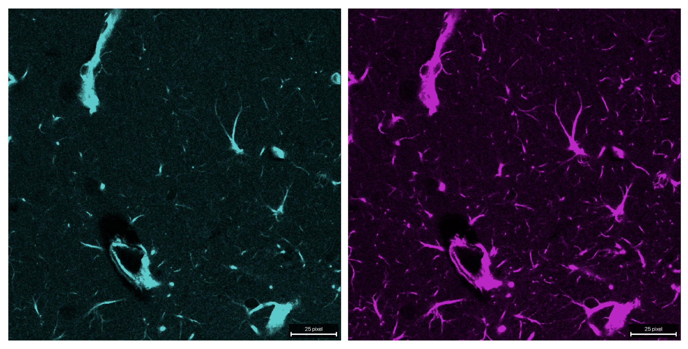

   The raw two-channel example stack used in this tutorial. Channel 0 (cyan) bleeds
   into channel 1 (magenta) and is thus the source channel. Channel 1 is the target channel 
   that we want to correct.

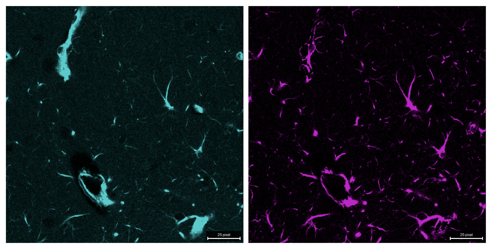

   Both channels after unmixing with a fixed alpha of 0.62. The bleed-through from channel 
   0 into channel 1 is largely removed, while the original signal in channel 1 is preserved.

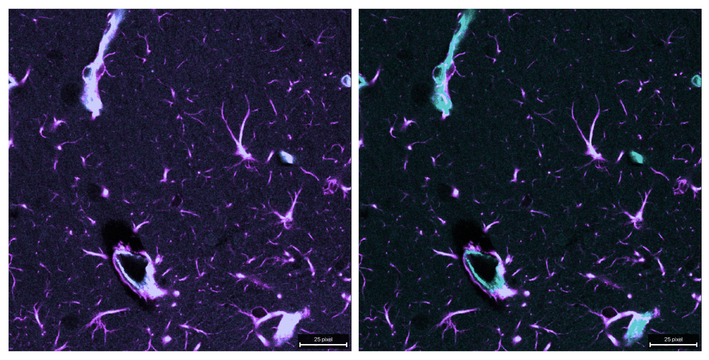

   Composite comparison of the raw (left) and unmixed (right) stack. The bleed-through from 
   channel 0 into channel 1 is clearly visible in the raw data, while it is largely removed 
   in the unmixed result and, thus, a more accurate representation of the true signal in channel 
   1 is obtained.

``mean_ratio`` method
---------------------

By changing the method to ``mean_ratio``, alpha is computed as the mean target 
intensity divided by the mean source intensity within a mask that is defined by 
the ``signal_percentile`` and ``background_percentile`` parameters:

.. literalinclude:: ../../user_scripts/unmix_example.py
   :language: python
   :start-after: # define the output path for the reference-time-point unmixing result:
   :end-before: # %% LINEAR-FIT EXAMPLE

Important parameters:

- ``method="mean_ratio"``:
  estimates alpha as the ratio of mean target and mean source intensity inside
  the selected source-dominant mask.
- ``signal_percentile``:
  defines how strict the bright-source mask is. Higher values keep only the
  brightest source voxels and make the estimate more selective; lower values
  include more voxels but may mix in less source-specific regions.
- ``background_percentile``:
  defines the low-percentile background level that is subtracted before alpha
  estimation. Increasing it removes more low-intensity baseline; decreasing it
  keeps more of the original dim signal.
- optional ``target_low_percentile``:
  further restricts the estimation mask to comparatively dim target voxels.
  Lower values make this restriction stricter; higher values relax it.
- optional ``preprocess_alpha_inputs``:
  switches the percentile-based background subtraction and clipping used only
  for alpha estimation. Turning it off makes the estimate depend more directly
  on the raw measured intensities.
- ``alpha_mode`` and ``alpha_reference_t``:
  become relevant for real multi-time-point stacks. ``reference_t`` estimates
  one alpha from the selected reference time point and applies it to all time
  points. The same ``mean_ratio`` estimator can also be combined with
  ``alpha_mode="per_t"`` when you want one separately estimated coefficient per
  time point. Please refer to the dedicated multi-time-point tutorial :doc:`usage_unmix_full_tzcyx_synthetic_example`
  for more details on that workflow.

Increasing ``signal_percentile`` makes the mask more selective. Lowering it
uses more voxels but may mix in less source-specific regions.

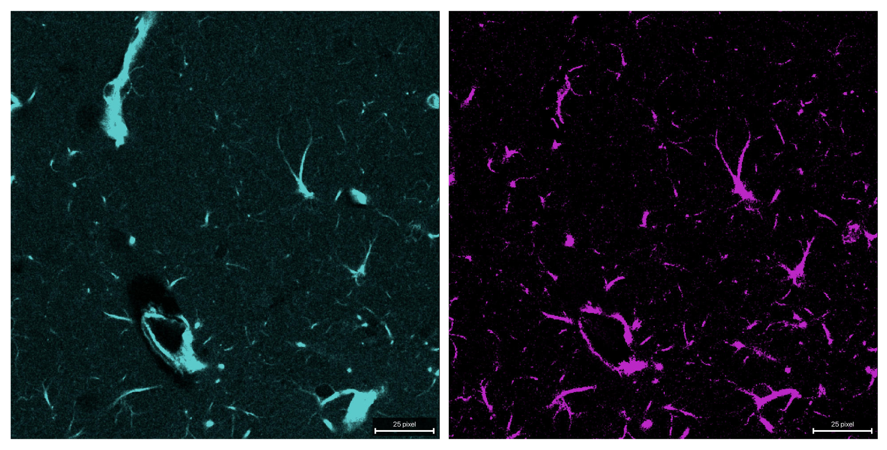

   Both channels after unmixing with the mean-ratio method. The bleed-through 
   from channel 0 into channel 1 is largely removed, while the original signal 
   in channel 1 is preserved. Note that the estimated alpha is slightly different 
   from the fixed value of 0.62 used in the previous example, as it is computed 
   from the data itself. Thus, the resulting unmixed image slightly differs in 
   the quality of bleed-through removal and the preservation of the original signal 
   in channel 1.

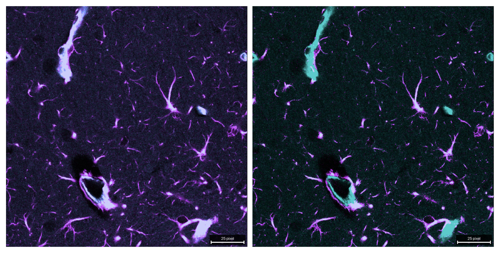

   Composite comparison of the raw (left) and unmixed (right) stack. 

``linear_fit`` method
---------------------

This variant estimates alpha via masked least squares without an intercept.
Use this when you want a fit-based coefficient rather than the simpler ratio of
means. It relies on the same mask and preprocessing parameters as the ``mean_ratio`` 
method:

.. literalinclude:: ../../user_scripts/unmix_example.py
   :language: python
   :start-after: # define the output path for the reference-time-point linear-fit unmixing result:
   :end-before: # %% CORR-MIN EXAMPLE

Useful optional controls are the same as for ``mean_ratio``:

- ``target_low_percentile``
- ``preprocess_alpha_inputs``
- ``clip_negative``

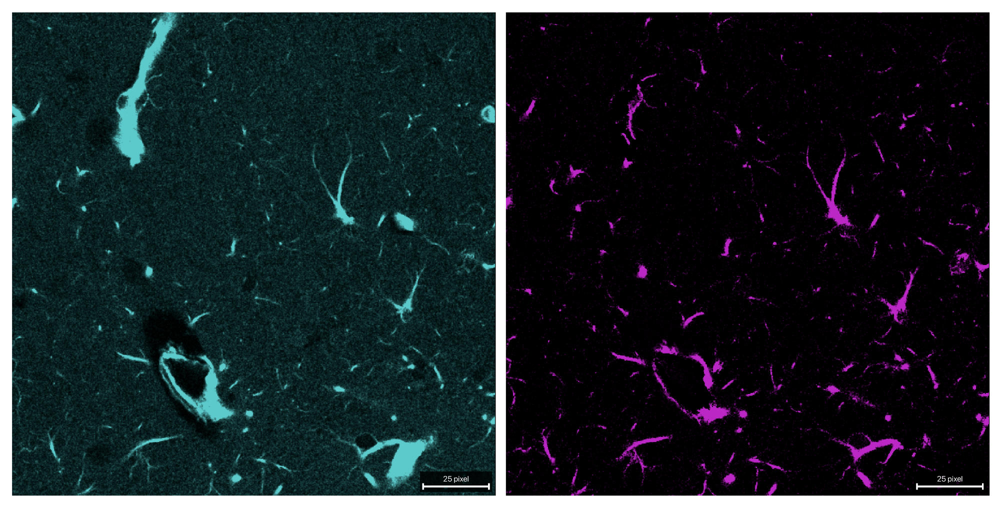

   Both channels after unmixing with the linear-fit method. Here, alpha is 
   estimated via masked least squares, which can provide a more robust estimate 
   in the presence of noise or outliers compared to the mean-ratio method. 
   The bleed-through from channel 0 into channel 1 is effectively removed, 
   while the original signal in channel 1 is preserved.

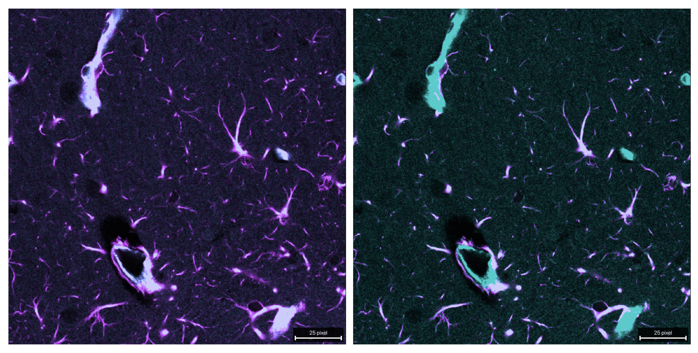

   Composite comparison of the raw (left) and unmixed (right) stack. 

``corr_min`` method
-------------------

This method chooses alpha such that correlation between the source channel and
the corrected target channel is minimized.

Useful parameters include:

- ``alpha_max``:
  upper bound of the optimization interval
- the same mask-related parameters as above

This method can be more aggressive than simple ratio-based estimation when
source and target channels are biologically correlated:

.. literalinclude:: ../../user_scripts/unmix_example.py
   :language: python
   :start-after: # define the output path for the reference-time-point corr-min unmixing result:
   :end-before: # %% MI-MIN EXAMPLE

Additional optional controls worth knowing are:

- ``target_low_percentile``
- ``preprocess_alpha_inputs``
- ``max_alpha_voxels``
- ``random_state``

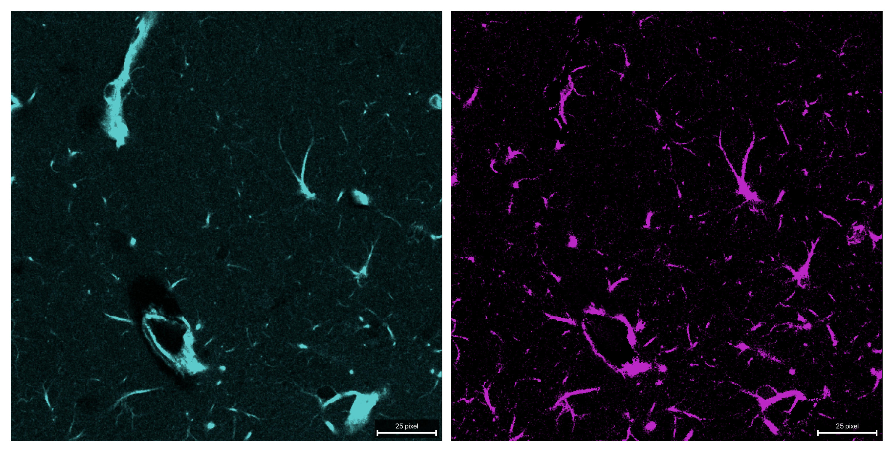

   Both channels after unmixing with the corr-min method. Here, alpha is 
   estimated via correlation minimization, which can be particularly effective 
   when the source and target channels are biologically correlated.

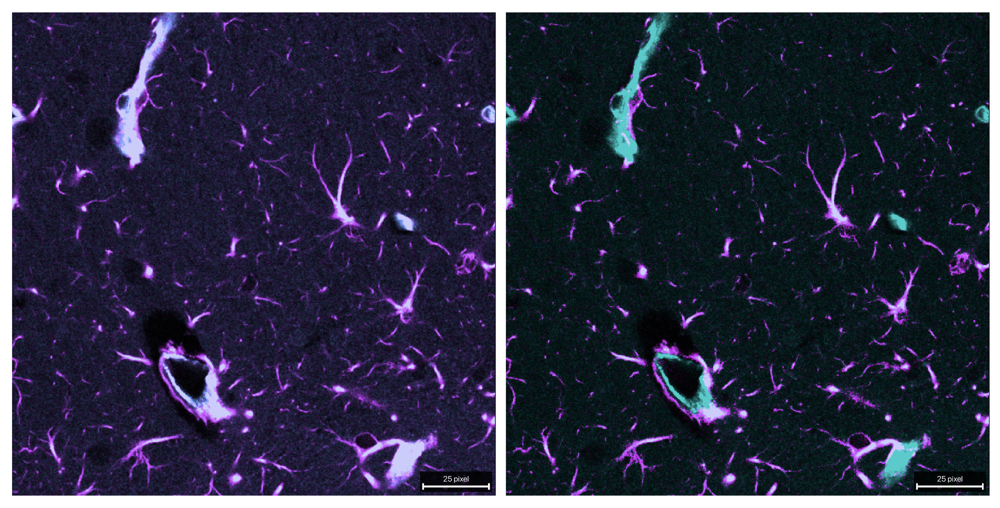

   Composite comparison of the raw (left) and unmixed (right) stack. 

``mi_min`` method
-----------------

This method uses a PICASSO-like criterion in the two-channel case by choosing
alpha to minimize mutual information between the source channel and the
corrected target channel.

Important user-tunable parameters:

- ``mi_bins``:
  histogram resolution for the mutual-information estimate. Higher values can
  resolve finer structure but also become noisier; lower values are coarser and
  usually more stable.
- ``alpha_max``:
  upper search bound for the optimized alpha. Larger values allow stronger
  subtraction; smaller values constrain the optimizer more conservatively.
- mask and background settings

.. literalinclude:: ../../user_scripts/unmix_example.py
   :language: python
   :start-after: # define the output path for the reference-time-point mi-min unmixing result:
   :end-before: # %% END

Further optional controls are:

- ``target_low_percentile``
- ``preprocess_alpha_inputs``
- ``max_alpha_voxels``
- ``random_state``

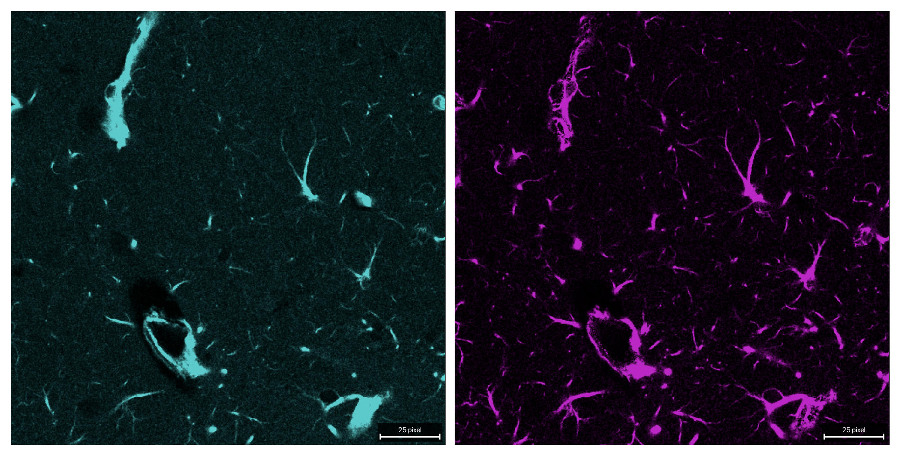

   Both channels after unmixing with the mi-min method. Here, alpha is 
   estimated via mutual information minimization, which can be particularly effective 
   when the source and target channels are biologically correlated.

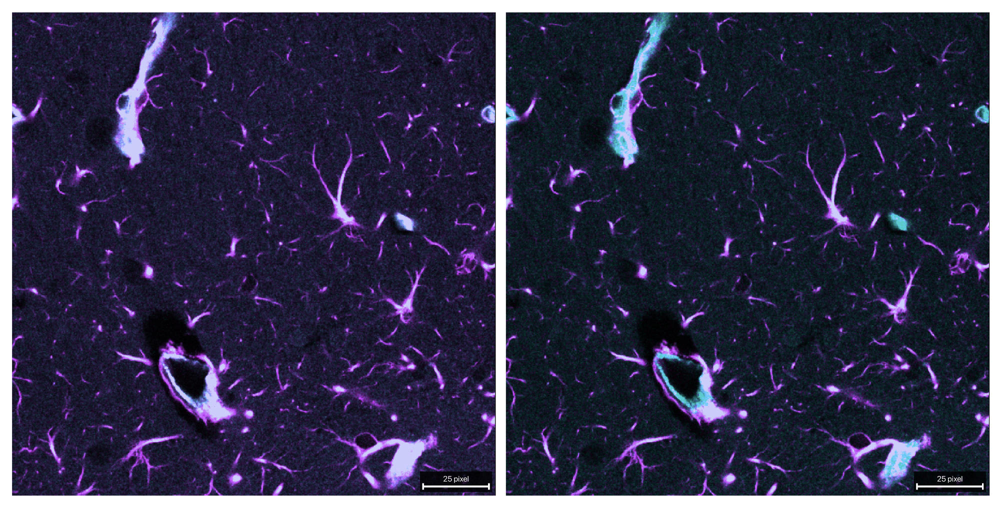

   Composite comparison of the raw (left) and unmixed (right) stack. 

What to change for your own data
--------------------------------

For a new dataset, the main things to adapt are:

- ``INPUT_PATH``
- ``source_channel`` and ``target_channel``
- your chosen alpha strategy:
  fixed, reference-time-point, or another method
- mask strictness via ``signal_percentile`` and
  ``target_low_percentile``

If a reliable single-label control exists, start with the fixed-alpha mode
first. It usually gives the most interpretable baseline.
