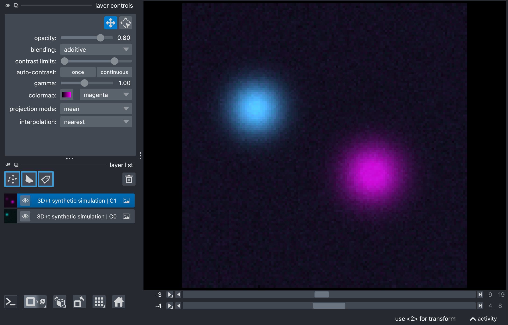
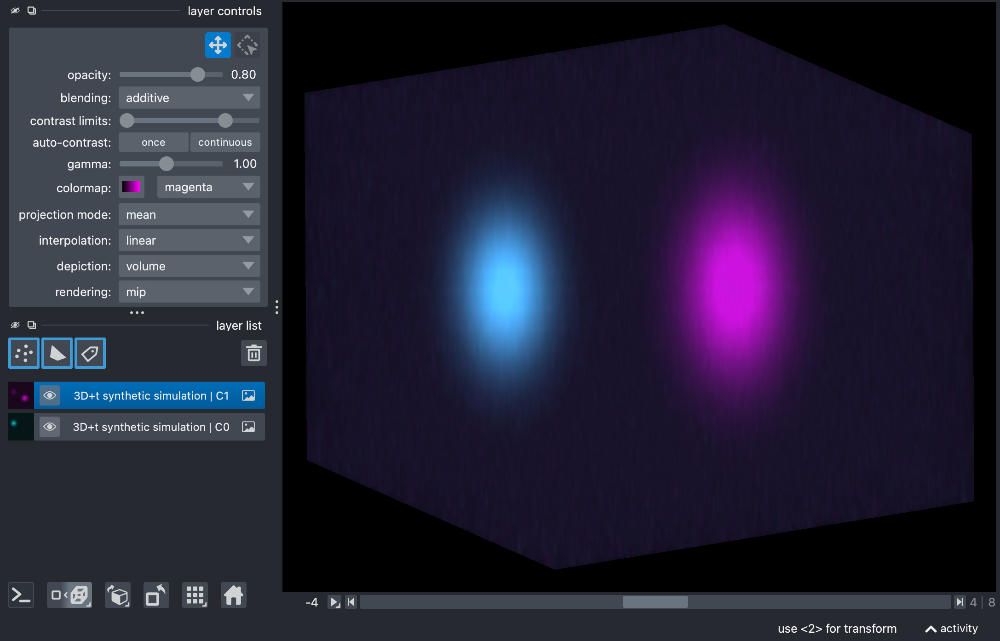
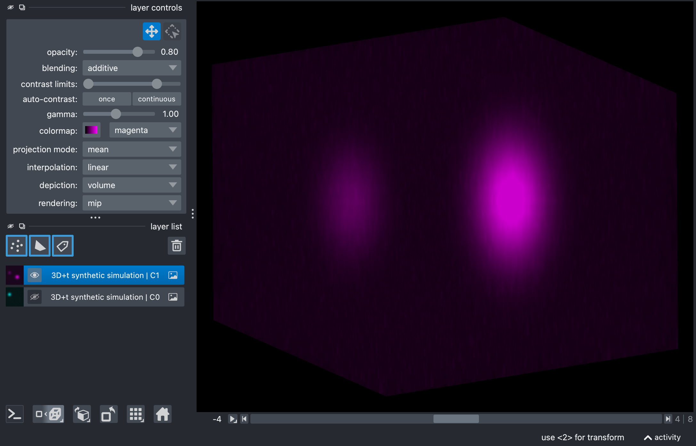
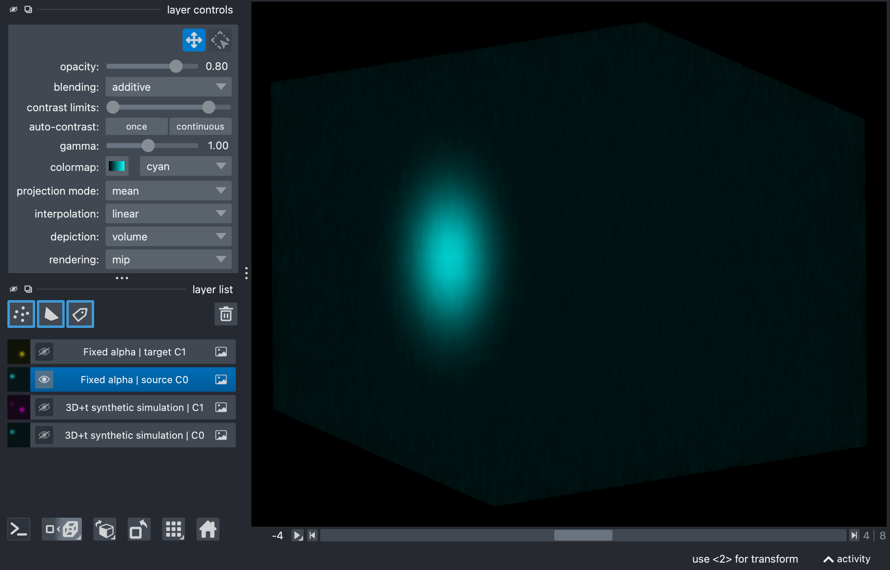
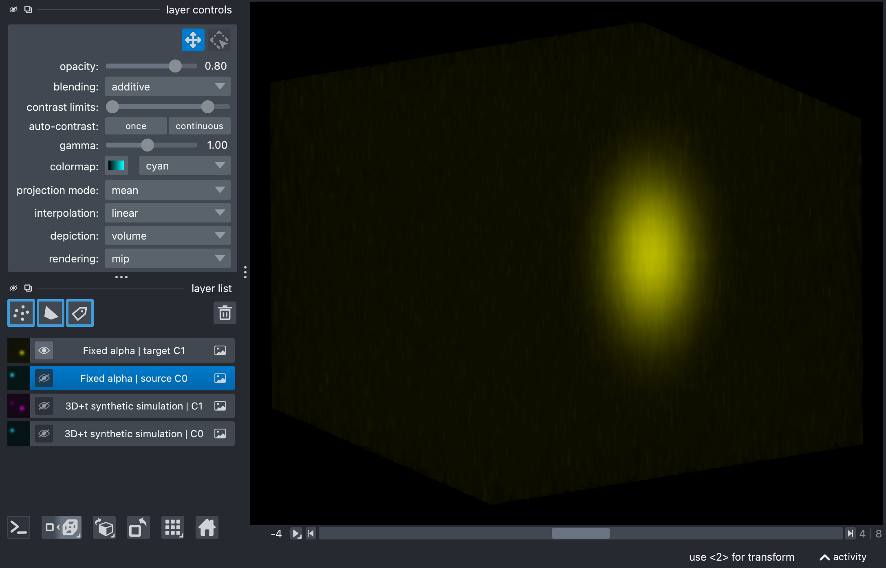

Full 3D+t unmixing example
==========================

This tutorial documents the interactive script
``user_scripts/unmix_full_TZCYX_synthetic_example.py``. It extends the basic
two-channel workflow to a full canonical ``TZCYX`` stack with multiple time
points and multiple z-slices.

How to use this tutorial
------------------------

The script is meant to be run as an interactive Python script in an editor that
supports cell-based execution.

The recommended workflow is:

1. open ``user_scripts/unmix_full_TZCYX_synthetic_example.py``,
2. run the cells from top to bottom,
3. adapt the parameters that matter for your own data.

The subsections below follow the same order as the script.

What this tutorial covers
-------------------------

Compared with :doc:`usage_unmix_example`, this script adds three important
practical ingredients:

- a full ``T > 1`` and ``Z > 1`` stack,
- a synthetic dataset with known bleed-through,
- and a per-time-point alpha-estimation example.

That makes it a good bridge between the simplest public example and a real
time-lapse z-stack workflow.

Imports
-------

.. literalinclude:: ../../user_scripts/unmix_full_TZCYX_synthetic_example.py
   :language: python
   :start-after: # import the required helper functions:
   :end-before: # %% INPUT AND OUTPUT PATHS

The imported helpers are the same as in the simpler two-channel tutorial:

- ``unmix(...)`` for the actual spectral unmixing,
- ``report_path_from_output_path(...)`` for inspecting the JSON sidecar,
- ``show_unmixed_channels_in_napari(...)`` for visual inspection.

Define input and output paths
-----------------------------

.. literalinclude:: ../../user_scripts/unmix_full_TZCYX_synthetic_example.py
   :language: python
   :start-after: # define the input path to the example dataset:
   :end-before: # %% FIXED ALPHA EXAMPLE

What you would usually change here:

- ``INPUT_PATH`` to your own `OMIO <https://omio.readthedocs.io/en/latest/>`_-readable stack,
- the output directory or filename pattern.

Manually set alpha
------------------

.. literalinclude:: ../../user_scripts/unmix_full_TZCYX_synthetic_example.py
   :language: python
   :start-after: # define the output path for the fixed-alpha unmixing result:
   :end-before: # %% REFERENCE-TIME-POINT ALPHA EXAMPLE (mean-ratio)

This is the simplest baseline on the full stack. The exact same fixed alpha is
applied across all time points and all z-slices.

The most relevant parameters are:

- ``method="manual"``:
  uses the user-provided alpha directly instead of estimating it from the data.
- ``alpha``:
  sets the subtraction strength. Larger values remove more source contribution;
  smaller values leave more residual bleed-through.
- ``alpha_mode``:
  can be set explicitly to ``fixed``, but this is not required. The default is
  ``None``. When ``alpha_mode=None`` and a user-provided ``alpha`` is present,
  the pipeline internally resolves to ``fixed``.
- optional ``source_channel`` and ``target_channel``:
  define the direction of correction through the full ``TZCYX`` stack.
- optional ``clip_negative``:
  clips negative corrected intensities to zero after subtraction.

This is the best starting point when you already have a coefficient from a
proper control measurement or an empirical estimate from a similar dataset. 

.. raw:: html

    

.. raw:: html

   

   

.. raw:: html
   
    

   Composite images of the raw synthetic stack, showing the source and target channels 
   in Napari's 2D (top) and 3D views (center). The source channel is shown in cyan, and the target 
   channel is shown in magenta. The images illustrate the bleed-through from the source to the 
   target channel (bottom), which will be corrected by the unmixing process.
   

.. raw:: html

   

.. raw:: html
   
    

   Results of the fixed-alpha unmixing on the synthetic stack, showing the source (top) 
   and target (bottom) channels in Napari's 3D view. The bleed-through from the source to the 
   target channel has been corrected.
   

``mean_ratio`` on a full ``TZCYX`` stack
----------------------------------------

.. literalinclude:: ../../user_scripts/unmix_full_TZCYX_synthetic_example.py
   :language: python
   :start-after: # define the output path for the reference-time-point unmixing result:
   :end-before: # %% REFERENCE-TIME-POINT LINEAR-FIT EXAMPLE

This is the simplest automatic estimator on a given dataset. It computes the ratio of mean
intensities inside a bright-source mask.

If ``alpha_mode`` is left unset or explicitly set to ``None``, the pipeline
does not stay in a hidden fixed mode. Instead, because no manual ``alpha`` is
provided here and ``method!="manual"``, the workflow automatically falls back
to ``alpha_mode="reference_t"`` with ``alpha_reference_t=0``. That default
works for both ``T=1`` and ``T>1`` stacks.

In this script the method is demonstrated explicitly with
``alpha_mode="reference_t"``, where one alpha is estimated from the selected
reference time point, using all z-slices belonging to that time point, and
then applied to all time points. The same ``mean_ratio`` estimator can also be
combined with ``alpha_mode="per_t"`` when you want one separately estimated
coefficient per time point.

The parameters that matter most are:

- ``alpha_mode``: 
  ``reference_t`` or ``per_t``. The former estimates one alpha from the reference time point;
  the latter estimates one alpha per time point. If this argument is omitted or set to ``None``,
  the pipeline defaults to ``reference_t`` with ``alpha_reference_t=0`` for non-manual methods
  such as the present ``mean_ratio`` example.
- ``alpha_reference_t``:
  defines the reference time point used for alpha estimation using ``alpha_mode="reference_t"``.
  Changing it matters when the stack changes in brightness, content, or other properties 
  such as SNR over time.
- ``signal_percentile``:
  defines how selective the bright-source mask is. Higher values keep only the
  brightest source voxels; lower values include more voxels and therefore more
  mixed regions.
- ``background_percentile``:
  defines the low-intensity background estimate subtracted before alpha
  estimation. Higher values remove more baseline; lower values preserve more of
  the dim signal.
- ``target_low_percentile``:
  can further restrict the estimation mask to target-dim voxels. Lower values
  make that restriction stricter, higher values relax it.
- ``preprocess_alpha_inputs``:
  controls whether the percentile-based preprocessing is applied before
  estimating alpha. Turning it off makes the estimate more directly dependent
  on the raw stack intensities.

.. note::

   If you explicitly set ``alpha_mode="reference_t"`` on a stack that
   effectively has only one time point (``T=1``), the pipeline simply uses
   ``t=0`` as the only valid reference time point. If you explicitly set
   ``alpha_mode="per_t"`` on a ``T=1`` stack, the pipeline does not fail
   either: it just estimates one alpha value for that single time point. In
   other words, both modes remain valid for ``T=1`` data; they just collapse to
   the only available time index.

``linear_fit`` on a full ``TZCYX`` stack
----------------------------------------

.. literalinclude:: ../../user_scripts/unmix_full_TZCYX_synthetic_example.py
   :language: python
   :start-after: # define the output path for the reference-time-point linear-fit unmixing result:
   :end-before: # %% REFERENCE-TIME-POINT CORR-MIN EXAMPLE

This variant replaces the ratio-of-means estimator by a masked least-squares
fit without intercept.

Use this when you want a fit-based coefficient but still want the same general
reference-time-point workflow. In practice, the most important settings remain
the mask and preprocessing parameters:

- ``signal_percentile``
- ``background_percentile``
- optional ``target_low_percentile``
- optional ``preprocess_alpha_inputs``

The script shows the ``reference_t`` version, but the same ``linear_fit``
estimator can also be used with ``alpha_mode="per_t"`` if one fitted alpha per
time point is more appropriate for your data.

``corr_min`` on a full ``TZCYX`` stack
--------------------------------------

.. literalinclude:: ../../user_scripts/unmix_full_TZCYX_synthetic_example.py
   :language: python
   :start-after: # define the output path for the reference-time-point corr-min unmixing result:
   :end-before: # %% REFERENCE-TIME-POINT MI-MIN EXAMPLE

This method chooses alpha so that residual correlation between source and
corrected target becomes minimal.

The most relevant tuning parameters are:

- ``alpha_max``:
  upper search bound for the optimization. Larger values allow more aggressive
  subtraction; smaller values constrain the estimator more conservatively.
- ``signal_percentile``
- ``background_percentile``
- optional ``target_low_percentile``
- optional ``max_alpha_voxels`` and ``random_state``

Again, the example here uses ``alpha_mode="reference_t"`` for clarity. The
same ``corr_min`` estimator can also be paired with ``alpha_mode="per_t"`` to
optimize one separate coefficient per time point.

Because the optimization is performed on the full-stack reference volume, this
example is useful for seeing how aggressive correlation-minimization can become
on richer data.

``mi_min`` on a full ``TZCYX`` stack
------------------------------------

.. literalinclude:: ../../user_scripts/unmix_full_TZCYX_synthetic_example.py
   :language: python
   :start-after: # define the output path for the reference-time-point mi-min unmixing result:
   :end-before: # %% PER-TIME-POINT ALPHA EXAMPLE

This method uses the two-channel PICASSO-like mutual-information criterion.

The most important settings are:

- ``mi_bins``:
  histogram resolution for the mutual-information objective. Higher values can
  capture finer structure but often become noisier; lower values are coarser
  and usually more stable.
- ``alpha_max``
- ``signal_percentile``
- ``background_percentile``
- optional ``target_low_percentile``
- optional ``max_alpha_voxels`` and ``random_state``

As in the previous sections, the script demonstrates the ``reference_t``
version first. The same ``mi_min`` estimator can also be combined with
``alpha_mode="per_t"`` if you want a separate mutual-information-based alpha
estimate at every time point.

Compared with the simpler estimators, this is often the slowest option, but it
can be useful when residual dependence remains visible after simpler
corrections.
