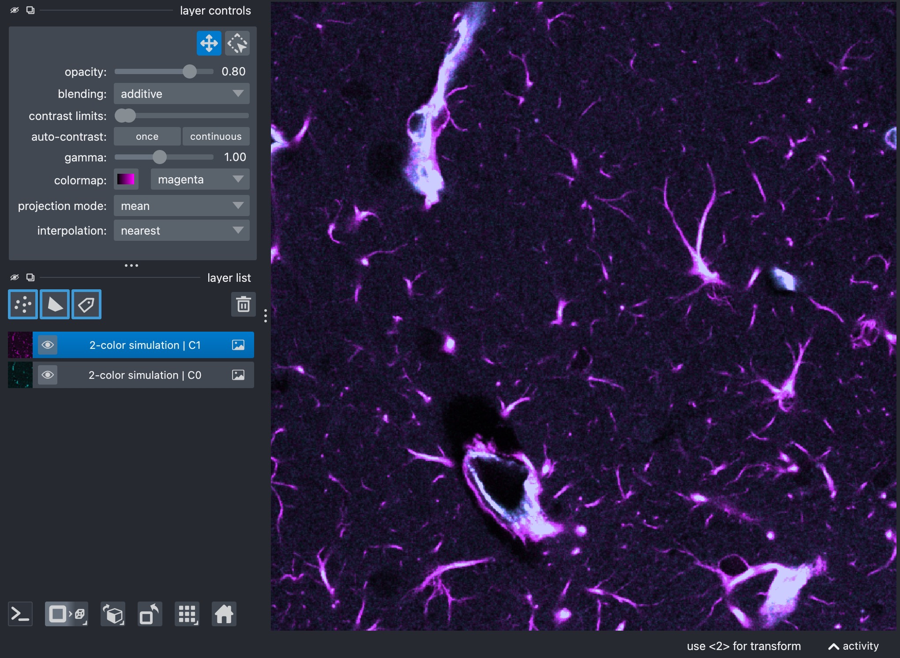
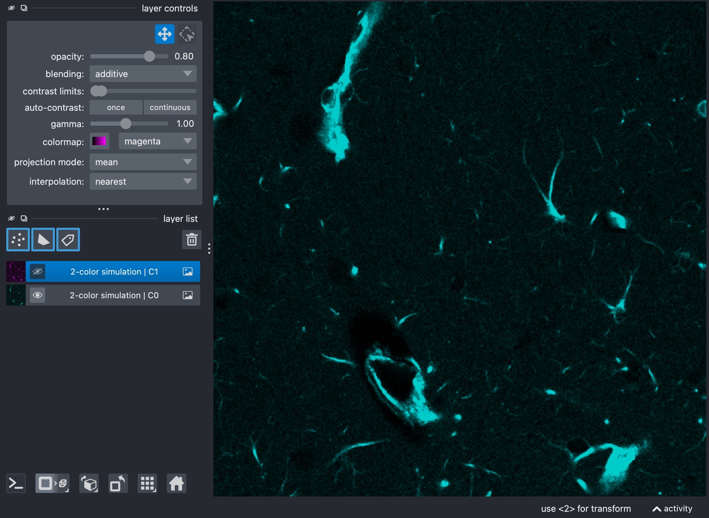
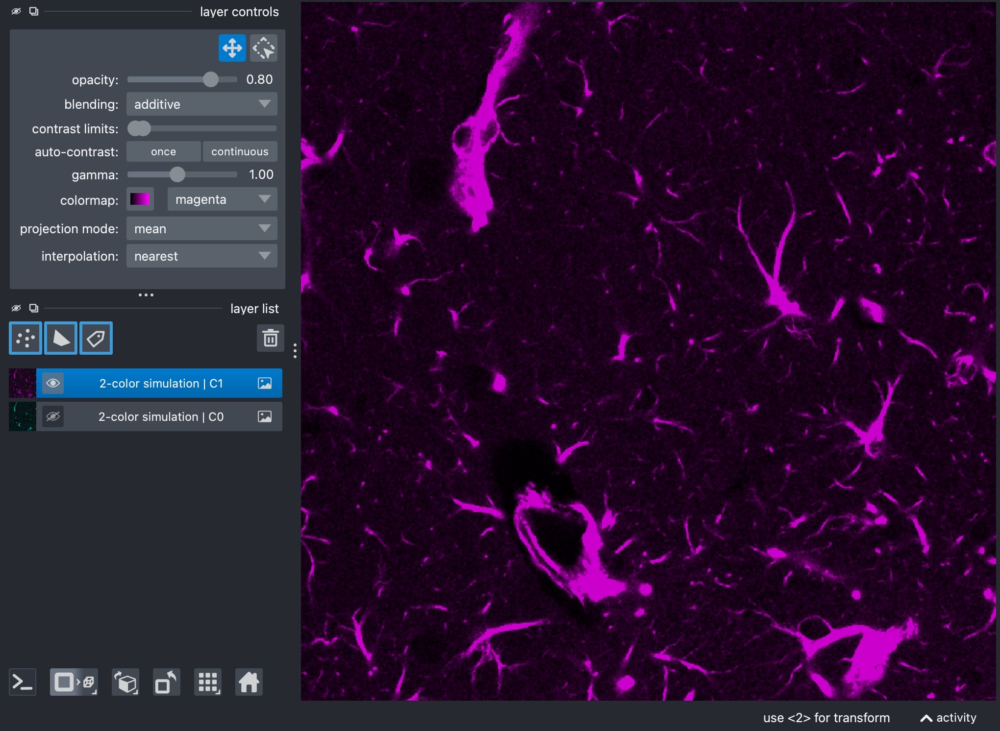
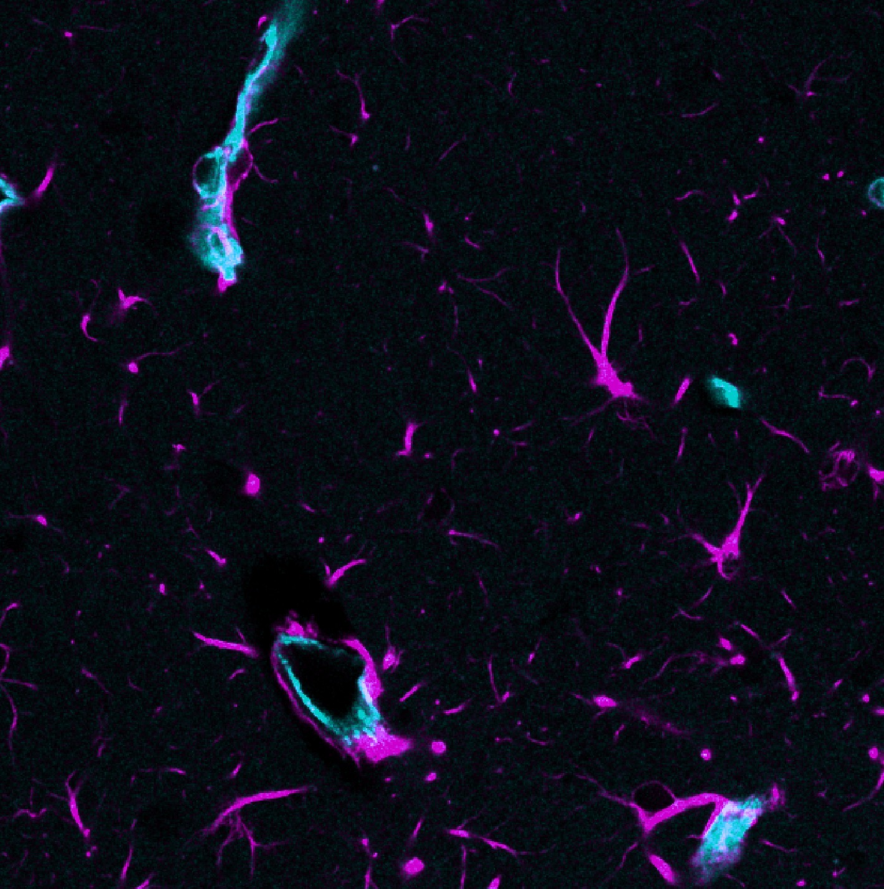
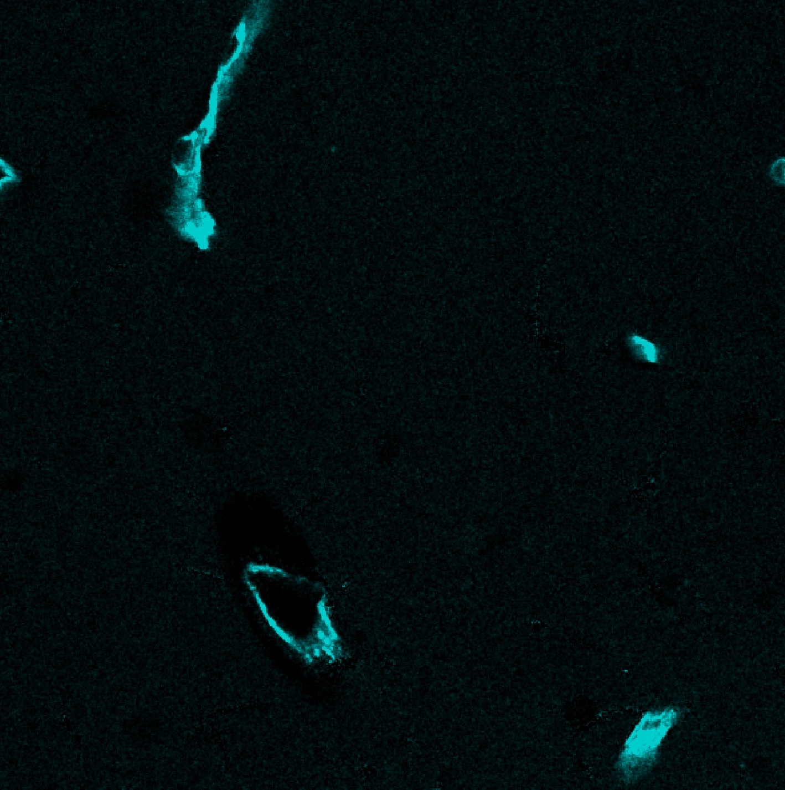
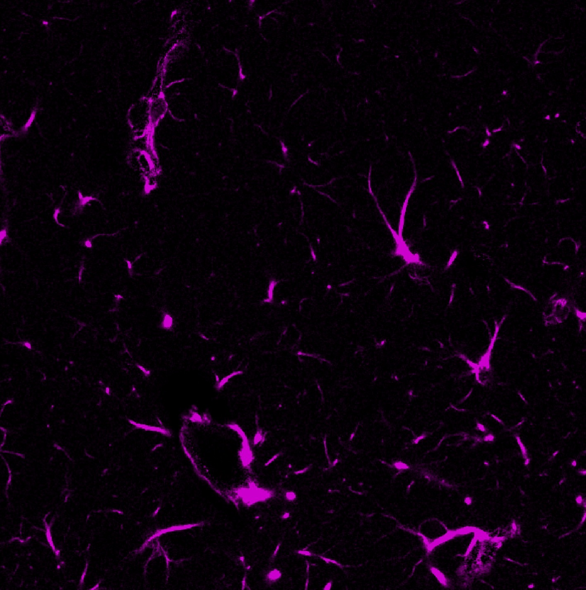
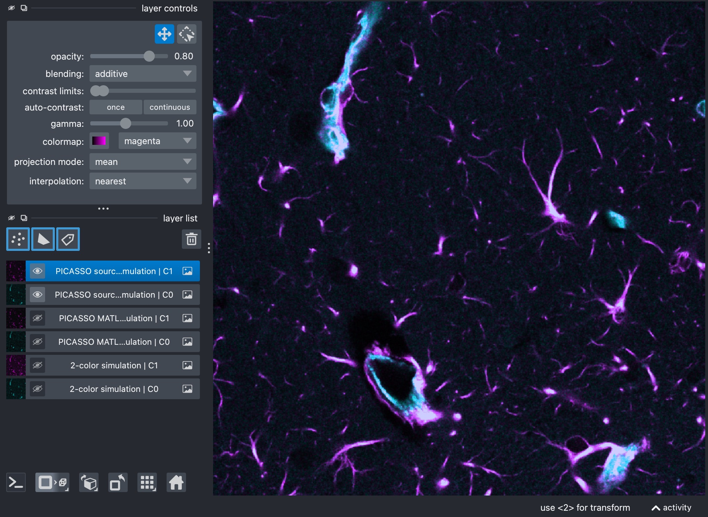
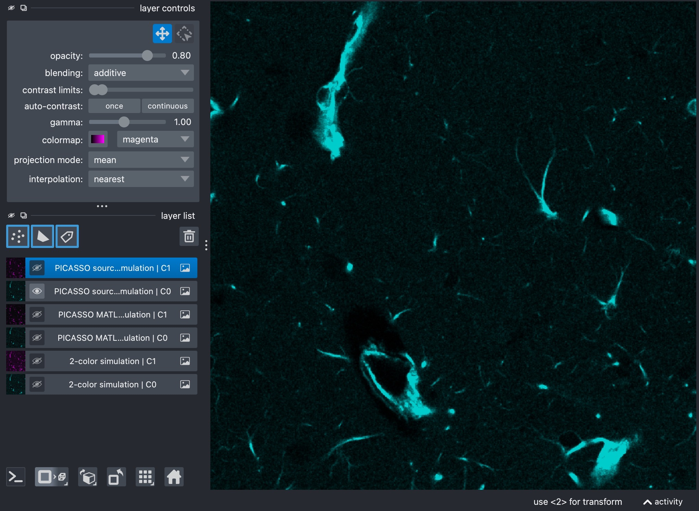
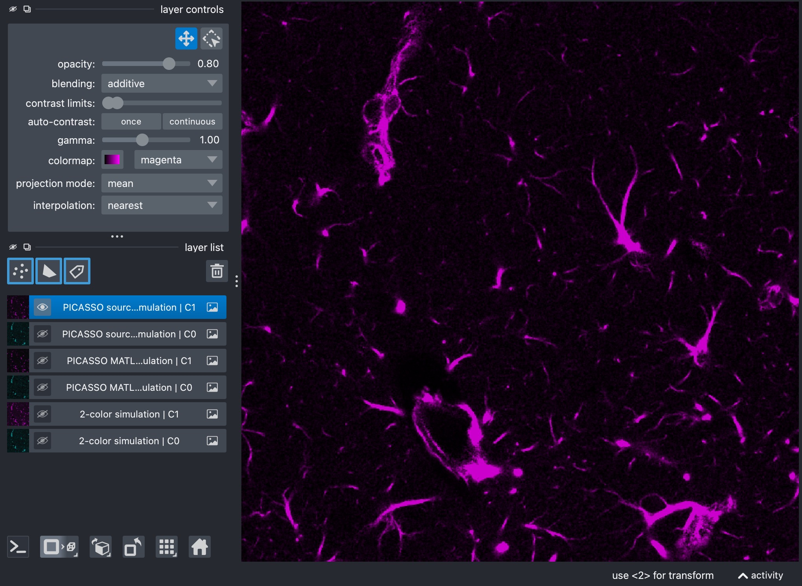

PICASSO 2-color example
=======================

This tutorial documents the interactive script
``user_scripts/unmix_picasso_2color_example.py``.

Even for two-channel data, ``unmix_picasso(...)`` can be useful when you want
to compare a blind-unmixing workflow against the standard directed
``unmix(...)`` approach.

The PICASSO-family blind-unmixing logic used here is motivated by the original
PICASSO paper:

   Seo, J., Sim, Y., Kim, J. et al. *PICASSO allows ultra-multiplexed
   fluorescence imaging of spatially overlapping proteins without reference
   spectra measurements*. Nature Communications 13, 2475 (2022).
   https://doi.org/10.1038/s41467-022-30168-z

How to use this tutorial
------------------------

The script is intended for interactive execution in an editor with cell support.

The recommended workflow is:

1. open ``user_scripts/unmix_picasso_2color_example.py``,
2. run the sections from top to bottom,
3. compare the blind-unmixing output against the simpler directed workflow if
   you have already worked through :doc:`usage_unmix_example`.

The subsections below follow the same order as the script.

What this tutorial covers
-------------------------

This is the smallest PICASSO-family example in the repository. It shows two
conceptually different blind-unmixing strategies:

- ``implementation="matlab_n"``, an N-channel generalization of the MATLAB
  PICASSO workflow,
- ``implementation="source_sink_n"``, a more explicit source-sink formulation.

Imports
-------

.. literalinclude:: ../../user_scripts/unmix_picasso_2color_example.py
   :language: python
   :start-after: # %% IMPORTS
   :end-before: # %% INPUT AND OUTPUT PATHS

Define input and output paths
-----------------------------

.. literalinclude:: ../../user_scripts/unmix_picasso_2color_example.py
   :language: python
   :start-after: # define the input path to the example dataset:
   :end-before: # %% INSPECT PREPARED STACKS IN NAPARI

The main thing to adapt here is ``INPUT_PATH``. The script automatically
creates output paths in an ``unmixed`` subfolder next to the input file.

Inspect the measured channels
-----------------------------

.. literalinclude:: ../../user_scripts/unmix_picasso_2color_example.py
   :language: python
   :start-after: # inspect the stack in Napari:
   :end-before: # %% PICASSO MATLAB-N EXAMPLE

This inspection step is worth keeping in your own scripts. It lets you verify
that the channels were loaded as expected before any blind-unmixing is applied.

.. raw:: html

    

.. raw:: html

   

   

.. raw:: html
   
    

   Composite view of the raw two-channel stack (top). Channel 0 
   is shown in cyan (center) and Channel 1 in magenta (bottom).
   Visual inspection of the raw measured channels is useful for confirming 
   channel order and for building intuition about which channels appear to 
   contaminate which others. Here, channel 0 is bleeding into channel 1, 
   but not vice versa. The goal of the blind-unmixing workflows is to estimate 
   the cross-talk coefficients and produce a corrected output stack in which the 
   channels are as cleanly separated as possible.
   

``matlab_n`` blind unmixing
---------------------------

.. literalinclude:: ../../user_scripts/unmix_picasso_2color_example.py
   :language: python
   :start-after: # define the output path for the PICASSO MATLAB-N unmixing result:
   :end-before: # %% PICASSO SOURCE-SINK-N EXAMPLE

This method applies the explicit N-channel generalization of the MATLAB-style
PICASSO iteration.

The most influential settings are:

- ``channels``:
  selects which measured channels participate in blind unmixing. Restricting
  this list simplifies the problem; expanding it increases coupling between
  channels.
- ``implementation="matlab_n"``:
  sets which PICASSO-family workflow is used. Here, we use the MATLAB-N generalization
  (``matlab_n``); the other options are ``matlab_3c`` and ``source_sink_n``.
- ``background_percentile``:
  low-percentile background estimate used during preprocessing before the
  MATLAB-style update sequence is estimated.
- ``preprocess_alpha_inputs``:
  enables or disables that preprocessing step. It is part of the shared API
  and is recorded in the JSON report.
- ``mi_bins``:
  retained in the shared API and JSON report for compatibility, but not used by
  the MATLAB-like implementation itself.
- ``alpha_max``:
  likewise retained in the shared API and JSON report, but not used directly by
  the MATLAB-like implementation.
- ``max_iter``:
  number of iterative update steps. More iterations can unmix more strongly but
  may also amplify instability.
- ``tolerance``:
  convergence threshold for the iterative updates. Smaller values require a
  smaller change before the iteration is considered stable.
- ``max_alpha_voxels``:
  optional voxel cap used during estimation on large stacks. Lower values speed
  up the run; higher values use more image information.
- ``step_size``:
  strength of each incremental update. Larger values make the updates more
  aggressive; smaller values make them more conservative.
- ``qN``:
  quantization parameter used in the MATLAB-style mutual-information
  calculation. Larger values retain finer intensity detail; smaller values make
  the estimate coarser.
- ``pixel_bin_size``:
  spatial binning factor before mutual-information evaluation. Larger values
  smooth and compress the data more strongly; smaller values preserve more
  spatial detail.
- ``alpha_clip``:
  hard clipping bound for pairwise coefficients. Larger values allow stronger
  pairwise subtraction; smaller values stabilize the iteration.
- optional ``negativity_threshold`` and ``clip_every_n_iterations``:
  control how aggressively intermediate negative values are monitored and how
  often positivity enforcement is applied.
- ``random_state``:
  random seed used whenever voxel subsampling is needed.
- ``clip_negative``:
  clips final negative values in the saved output stack to zero.
- ``output_dtype``:
  controls the data type used when the unmixed output is written.
- ``verbose``:
  enables terminal progress output and report printing during the run.

.. raw:: html

    

.. raw:: html

   

   

.. raw:: html
   
    

   Results of the MATLAB-N blind unmixing workflow. The composite view (top) shows 
   the unmixed channels in cyan (center) and magenta (bottom). The MATLAB-N workflow 
   is a direct generalization of the original PICASSO Matlab-3c logic. It is
   often a good starting point for blind unmixing and does not require the user to define 
   a source-sink graph explicitly.

The example script shown here uses a stack with only one time point, so
``alpha_mode`` and ``alpha_reference_t`` are left commented out in the code. For 
real multi-time-point stacks, you would usually
set ``alpha_mode="reference_t"`` explicitly when one shared coefficient per
direction should be estimated from a chosen reference time point, or
``alpha_mode="per_t"`` when one forward and one reverse coefficient should be
estimated separately for each time point. In these cases, additional relevant parameters 
are:

- ``alpha_mode``: ``reference_t`` or ``per_t`` for multi-time-point stacks.
  The former estimates one update sequence from the chosen reference time
  point and then applies it to the full stack; the latter estimates one update
  sequence per time point.
- ``alpha_reference_t``:
  defines the reference time point from which the update sequence is
  estimated. Only relevant when ``alpha_mode="reference_t"``.

``source_sink_n`` blind unmixing
--------------------------------

.. literalinclude:: ../../user_scripts/unmix_picasso_2color_example.py
   :language: python
   :start-after: # define the output path for the PICASSO source-sink-N unmixing result:
   :end-before: # %% END

This variant uses a more explicit source-sink description of the expected
cross-talk graph.

In the current implementation, all sources contributing to one sink are
optimized jointly by default, and the workflow can additionally estimate a
small background offset for each modeled source-sink relation. This brings the
method closer to the source-sink formulation used by the napari PICASSO plugin,
while still relying on histogram-based mutual information rather than the
plugin's neural MINE estimator.

The most relevant settings are:

- ``channels``:
  as above, selects which measured channels participate in the explicit
  source-sink run.
- ``implementation="source_sink_n"``:
  sets which PICASSO-family workflow is used. Here, we use the source-sink-N generalization.
- ``sink_channels``:
  defines which channels should be corrected as sinks.
- ``neutral_channels``:
  defines which channels should stay untouched and not be used as active
  participants in the inferred source-sink graph.
- optional ``source_sink_matrix``:
  gives full manual control over the allowed source-to-sink relations.
- ``background_percentile``:
  same role as above, but now used in the source-sink coefficient estimation.
- ``preprocess_alpha_inputs``:
  same shared preprocessing switch as above.
- ``alpha_max``:
  now actively used as the upper bound for source-to-sink coefficients.
- ``mi_bins``:
  now actively used as the histogram resolution for the mutual-information
  objective.
- ``max_iter``:
  controls the maximum number of optimizer iterations for each sink.
- ``tolerance``:
  stopping tolerance for the numerical optimizer.
- ``max_alpha_voxels``:
  same optional voxel cap as above.
- ``source_sink_optimize_background``:
  if enabled, estimate one small background offset ``beta`` per modeled
  source-sink relation before subtracting the source contribution.
- ``source_sink_max_background``:
  upper bound for these optimized background offsets on normalized intensities.
- ``source_sink_joint_optimization``:
  if enabled, optimize all sources contributing to the same sink together
  instead of fitting them greedily one after another.
- ``source_sink_n_restarts``:
  number of multi-start optimizer initializations used for each sink.
- ``random_state``:
  same random seed used for optional voxel subsampling.
- ``clip_negative``:
  same final clipping behavior as above.
- ``output_dtype``:
  same output dtype control as above.
- ``verbose``:
  same terminal verbosity control as above.
- ``alpha_mode`` and ``alpha_reference_t``:
  same time-axis controls as above for real multi-time-point stacks.

For two-channel data this is often the easier PICASSO-family mode to reason
about, because one can state very directly which channel should be treated
as the sink and which one is allowed to act as the source. In the specific
example script, ``channel 1`` is treated as the sink and ``channel 0`` as the
source.

.. raw:: html

    

.. raw:: html

   

   

.. raw:: html
   
    

   Results of the source-sink-N blind unmixing workflow. The composite view (top) shows the
   unmixed channels in cyan (center) and magenta (bottom). The source-sink-N workflow is
   often the easiest PICASSO-family mode to reason about biologically, because the user
   can explicitly define which channels are allowed to act as sources and which
   channels are allowed to act as sinks.

.. note::

   If you want to define ``source_sink_matrix`` manually, the package uses the
   following convention:

   - rows correspond to **source** channels
   - columns correspond to **sink** channels
   - the diagonal must always be ``1``
   - an allowed source-to-sink relation is encoded as ``-1``
   - all other off-diagonal entries must be ``0``

   For the present 2-channel case with ``channels=[0, 1]``, if channel 0 is
   allowed to bleed into channel 1 but not vice versa, the manual matrix is:

   .. code-block:: python

      source_sink_matrix = [
          [1, -1],
          [0,  1],
      ]

   Here, the entry in row 0, column 1 is ``-1`` because channel 0 acts as a
   source for sink channel 1.

   If both directions should be allowed in a 2-channel case, the matrix would
   be:

   .. code-block:: python

      source_sink_matrix = [
          [1, -1],
          [-1, 1],
      ]

   For a 3-channel case with ``channels=[0, 1, 2]``, suppose channel 1 should
   be cleaned and channels 0 and 2 are both allowed to contribute to it. Then
   the matrix becomes:

   .. code-block:: python

      source_sink_matrix = [
          [1, -1, 0],
          [0,  1, 0],
          [0, -1, 1],
      ]

   More generally, for ``N`` selected channels, you always start from the
   identity matrix of size ``N x N`` and then place ``-1`` exactly at those
   positions ``(i, j)`` for which source channel ``i`` should be allowed to
   contribute to sink channel ``j``. If you do not want to build that matrix by
   hand, the higher-level ``sink_channels`` and ``neutral_channels`` interface
   is usually the more convenient option.
