PICASSO 3-color example
=======================

This tutorial documents the interactive script
``user_scripts/unmix_picasso_3color_example.py``.

It is the most direct comparison point between:

- the original 3-channel MATLAB PICASSO workflow,
- the explicit N-channel generalization,
- and the source-sink formulation.

The PICASSO-family methods documented here are motivated by the original
PICASSO paper:

   Seo, J., Sim, Y., Kim, J. et al. *PICASSO allows ultra-multiplexed
   fluorescence imaging of spatially overlapping proteins without reference
   spectra measurements*. Nature Communications 13, 2475 (2022).
   https://doi.org/10.1038/s41467-022-30168-z

How to use this tutorial
------------------------

The script is designed for interactive execution.

The recommended workflow is:

1. open ``user_scripts/unmix_picasso_3color_example.py``,
2. inspect the measured channels first,
3. compare the three different blind-unmixing implementations on the same
   stack.

The subsections below follow the same order as the script.

Imports
-------

.. literalinclude:: ../../user_scripts/unmix_picasso_3color_example.py
   :language: python
   :start-after: # %% IMPORTS
   :end-before: # %% INPUT AND OUTPUT PATHS

Define input and output paths
-----------------------------

.. literalinclude:: ../../user_scripts/unmix_picasso_3color_example.py
   :language: python
   :start-after: # define the input path to the example dataset:
   :end-before: # %% INSPECT PREPARED STACKS IN NAPARI

Inspect the measured channels
-----------------------------

.. literalinclude:: ../../user_scripts/unmix_picasso_3color_example.py
   :language: python
   :start-after: # inspect the stack in Napari:
   :end-before: # %% PICASSO MATLAB-N EXAMPLE

Before any unmixing is applied, the script opens the measured stack in napari.
This is useful for confirming channel order and for building intuition about
which channels appear to contaminate which others.

.. raw:: html

    

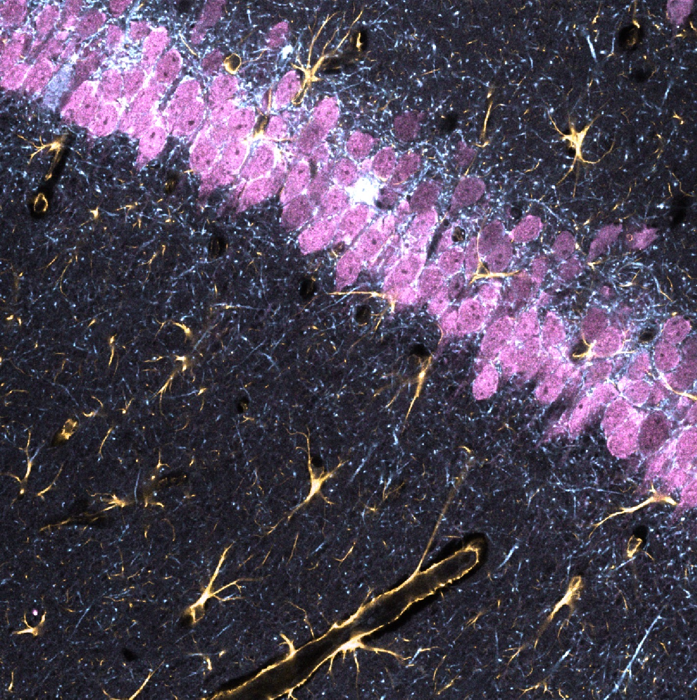

.. raw:: html

   

   

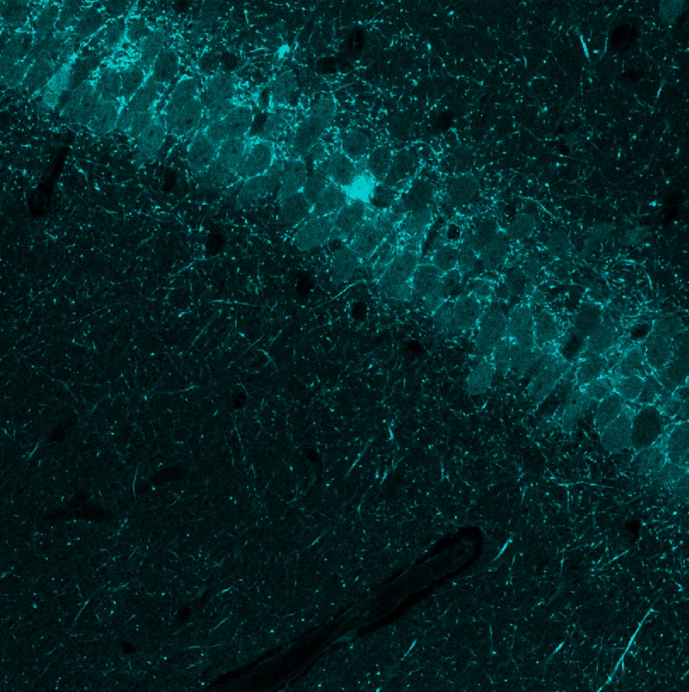

.. raw:: html

   

   

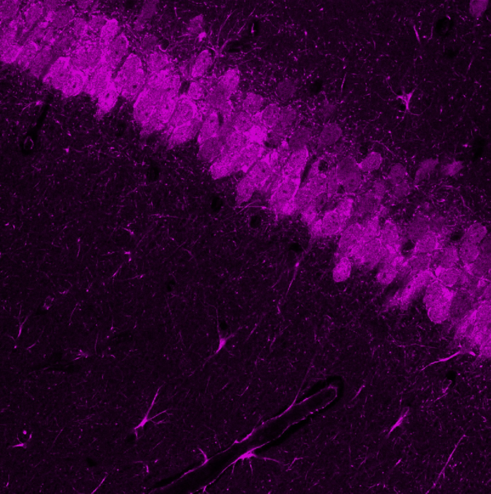

.. raw:: html

   

   

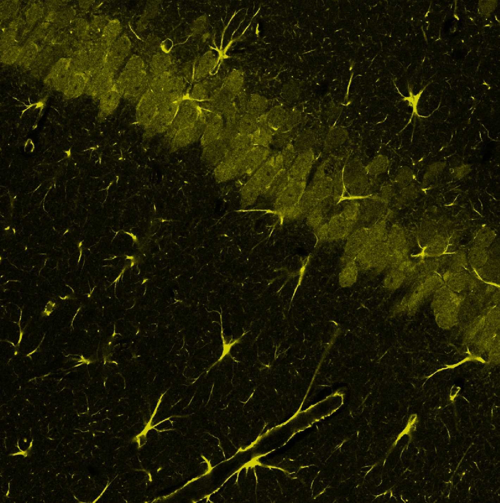

.. raw:: html
   
    

   Composite view of the raw three-channel stack (top). Channel 0 
   is shown in cyan (top center), Channel 1 in magenta (bottom center), and Channel 2 
   in yellow (bottom). The channels are clearly contaminated by each other.
   

``matlab_n`` blind unmixing
---------------------------

.. literalinclude:: ../../user_scripts/unmix_picasso_3color_example.py
   :language: python
   :start-after: # define the output path for the PICASSO MATLAB-N unmixing result:
   :end-before: # %% PICASSO MATLAB-3C EXAMPLE

This method keeps the MATLAB-style iterative logic, but uses the generalized
``matlab_n`` implementation rather than the strict 3-channel port.

The settings that matter most are:

- ``channels``:
  selects which measured channels participate in the blind-unmixing run.
- ``implementation="matlab_n"``:
  chooses the generalized MATLAB-style path rather than the strict
  three-channel port.
- ``background_percentile``:
  low-percentile background estimate used during preprocessing before the
  update sequence is estimated.
- ``preprocess_alpha_inputs``:
  enables or disables that shared preprocessing step.
- ``mi_bins``:
  retained in the shared API and JSON report for compatibility, but not used by
  the MATLAB-like implementation itself.
- ``alpha_max``:
  likewise retained in the shared API and JSON report, but not used directly by
  the MATLAB-like implementation.
- ``max_iter``:
  number of iterative updates. More iterations can unmix more strongly but may
  also become less stable.
- ``tolerance``:
  convergence threshold for the iterative update sequence.
- ``max_alpha_voxels``:
  optional voxel cap for large stacks. Lower values speed up the run; higher
  values use more of the measured image data.
- ``step_size``:
  strength of each update step. Larger values are more aggressive; smaller
  values are more conservative.
- ``qN``:
  quantization parameter for the MATLAB-style mutual-information estimate.
- ``pixel_bin_size``:
  spatial binning factor before the mutual-information calculation. Larger
  values smooth more strongly; smaller values preserve more detail.
- ``alpha_clip``:
  clipping bound for pairwise coefficients. Larger values allow stronger
  pairwise subtraction.
- optional ``negativity_threshold`` and ``clip_every_n_iterations``:
  control how intermediate negativity is monitored and how often positivity
  enforcement is applied.
- ``random_state``:
  random seed used whenever voxel subsampling is needed.
- ``clip_negative``:
  clips final negative values in the written output to zero.
- ``output_dtype``:
  controls the saved data type of the unmixed stack.
- ``verbose``:
  enables terminal progress output during the run.
- ``alpha_mode`` and ``alpha_reference_t``:
  become relevant for real multi-time-point stacks. ``reference_t`` estimates
  one update sequence from one chosen time point; ``per_t`` estimates one
  sequence per time point.

This is the best choice when you want MATLAB-like behavior but also want the
same conceptual workflow to scale to larger channel counts.

.. raw:: html

    

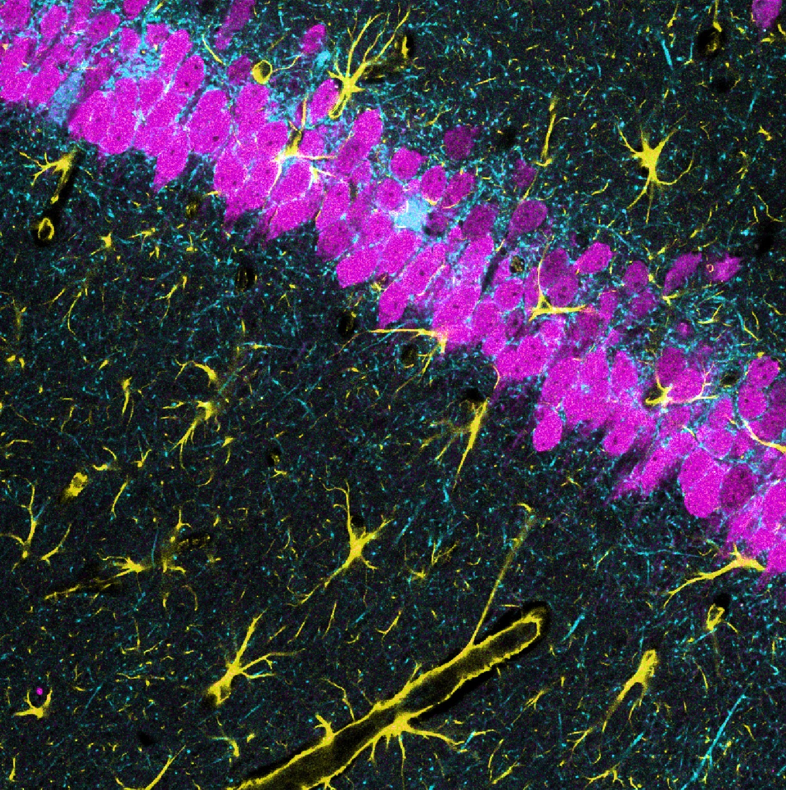

.. raw:: html

   

   

.. raw:: html

   

   

.. raw:: html

   

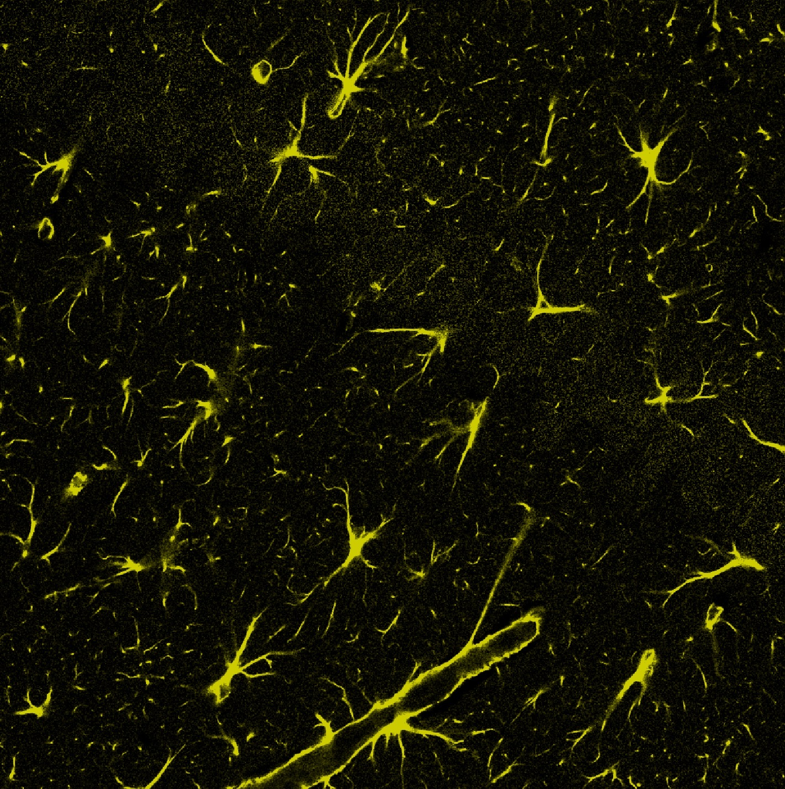

   Composite view of the unmixed three-channel stack after the MATLAB-N blind-unmixing 
   run (top). The MATLAB-N implementation has successfully removed most of the cross-talk 
   between the channels, which are now cleanly separated. 

``matlab_3c`` blind unmixing
----------------------------

.. literalinclude:: ../../user_scripts/unmix_picasso_3color_example.py
   :language: python
   :start-after: # define the output path for the PICASSO MATLAB-3C unmixing result:
   :end-before: # %% PICASSO SOURCE-SINK-N EXAMPLE

This is the closest available Python analogue of the original MATLAB
three-channel workflow.

Use this mode when exact three-channel comparison to the classic PICASSO logic
is more important than having a unified N-channel code path.

The main settings remain the MATLAB-style iteration parameters:

- ``channels``:
  same role as above, but here exactly three selected channels are required.
- ``implementation="matlab_3c"``
- ``background_percentile``
- ``preprocess_alpha_inputs``
- ``mi_bins`` and ``alpha_max``:
  same shared API parameters as above; recorded but not used directly by the
  MATLAB-like implementation
- ``max_iter``
- ``tolerance``
- ``max_alpha_voxels``
- ``step_size``
- ``qN``
- ``pixel_bin_size``
- ``alpha_clip``
- optional ``negativity_threshold`` and ``clip_every_n_iterations``
- ``random_state``
- ``clip_negative``
- ``output_dtype``
- ``verbose``
- ``alpha_mode`` and ``alpha_reference_t`` for multi-time-point stacks:
  same behavior as in the ``matlab_n`` example above

.. raw:: html

    

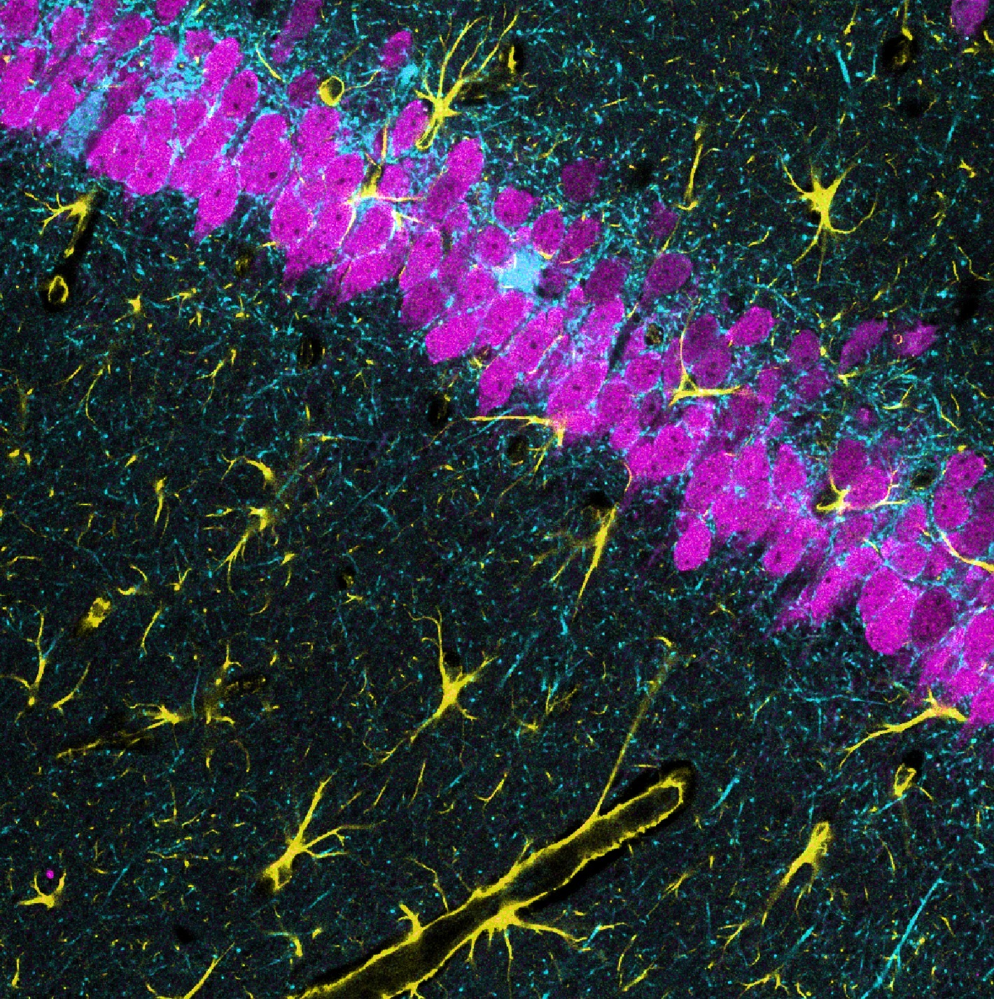

.. raw:: html

   

   

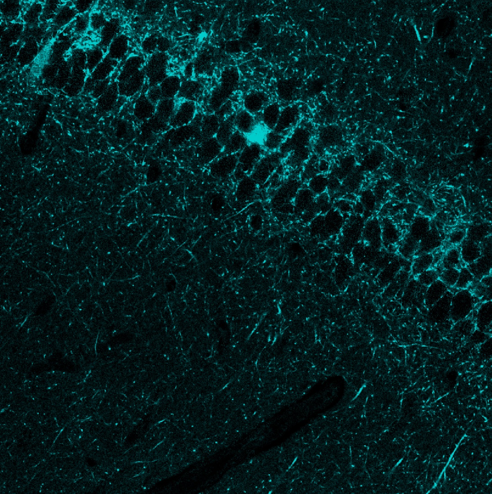

.. raw:: html

   

   

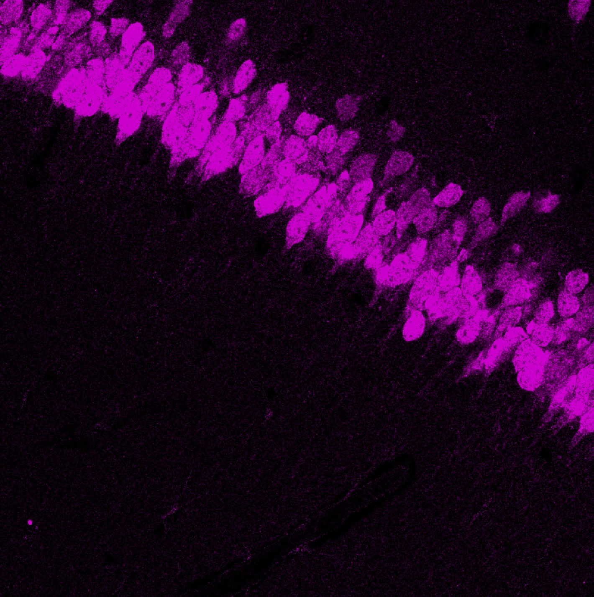

.. raw:: html

   

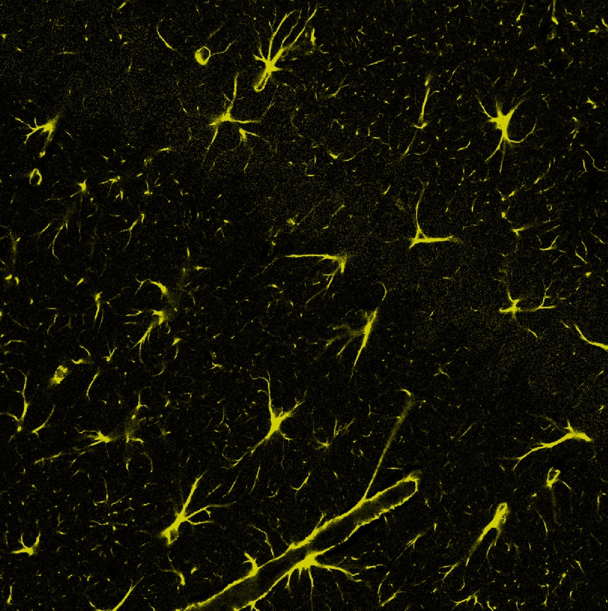

   Also the MATLAB-3C implementation has successfully removed most of the cross-talk 
   between the channels, which are now cleanly separated. The results are very similar 
   to the MATLAB-N run above. In fact, the latter is a generalized version of the former, 
   so the results are expected to be nearly identical.

``source_sink_n`` blind unmixing
--------------------------------

.. literalinclude:: ../../user_scripts/unmix_picasso_3color_example.py
   :language: python
   :start-after: # define the output path for the PICASSO source-sink-N unmixing result:
   :end-before: # %% END

This variant uses an explicit source-sink description of the expected bleed-
through graph.

In the current implementation, all sources contributing to one sink are
optimized jointly by default, and the workflow can additionally estimate a
small background offset for each modeled source-sink relation. This brings the
method closer to the source-sink formulation used by the napari PICASSO plugin,
while still relying on histogram-based mutual information rather than the
plugin's neural MINE estimator.

The most relevant settings are:

- ``channels``:
  as above, selects which measured channels participate in the explicit
  source-sink run.
- ``implementation="source_sink_n"``:
  chooses the source-sink PICASSO-family workflow rather than the MATLAB-like
  implementations.
- ``sink_channels``:
  defines which channels should be corrected as sinks.
- ``neutral_channels``:
  defines which channels should remain untouched and not act as sinks.
- optional ``source_sink_matrix``:
  gives explicit manual control over the allowed bleed-through graph.
- ``background_percentile``:
  same role as above, but now used in source-sink coefficient estimation.
- ``preprocess_alpha_inputs``:
  same shared preprocessing switch as above.
- ``alpha_max``:
  now actively used as the upper bound for source-to-sink coefficients.
- ``mi_bins``:
  now actively used as the histogram resolution for the mutual-information
  objective.
- ``max_iter``:
  controls the maximum number of optimizer iterations for each sink.
- ``tolerance``:
  stopping tolerance for the numerical optimizer.
- ``max_alpha_voxels``:
  same optional voxel cap as above.
- ``source_sink_optimize_background``:
  if enabled, estimate one small background offset ``beta`` per modeled
  source-sink relation before subtracting the source contribution.
- ``source_sink_max_background``:
  upper bound for these optimized background offsets on normalized intensities.
- ``source_sink_joint_optimization``:
  if enabled, optimize all sources contributing to the same sink together
  instead of fitting them greedily one after another.
- ``source_sink_n_restarts``:
  number of multi-start optimizer initializations used for each sink.
- ``random_state``:
  same random seed used for optional voxel subsampling.
- ``clip_negative``:
  same final clipping behavior as above.
- ``output_dtype``:
  same output dtype control as above.
- ``verbose``:
  same terminal verbosity control as above.
- ``alpha_mode`` and ``alpha_reference_t``:
  same time-axis controls as above for real multi-time-point stacks.

This is often the easiest mode to reason about biologically, because the user
can describe which channels should actually be cleaned and which channels
should remain untouched or act only as sources. In the specific example script,
``channel 1`` is treated as the sink, while ``channel 0`` and ``channel 2``
are allowed to act as sources by default. If only the
``channel 0 \rightarrow channel 1`` relation should be modeled, ``channel 2``
can be moved into ``neutral_channels``.

.. raw:: html

    

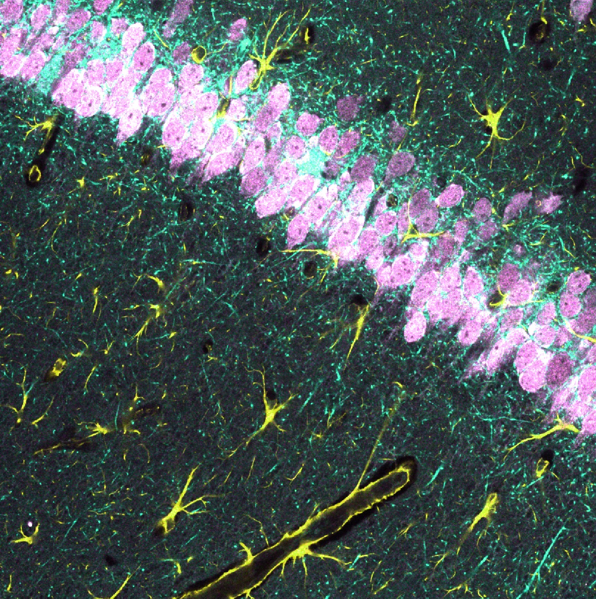

.. raw:: html

   

   

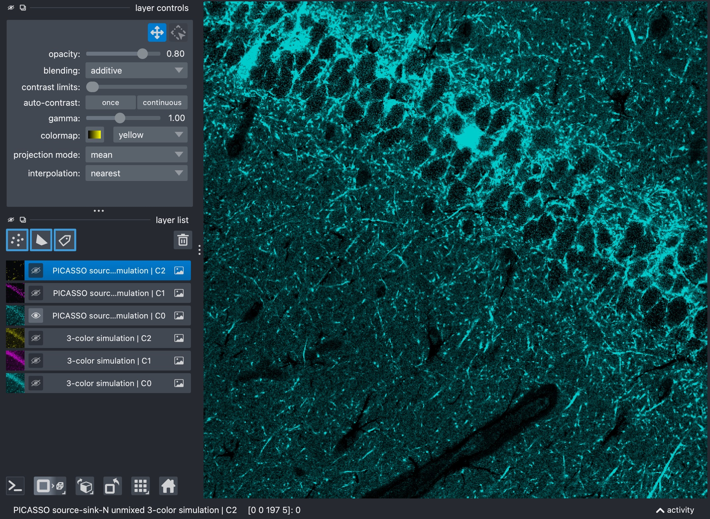

.. raw:: html

   

   

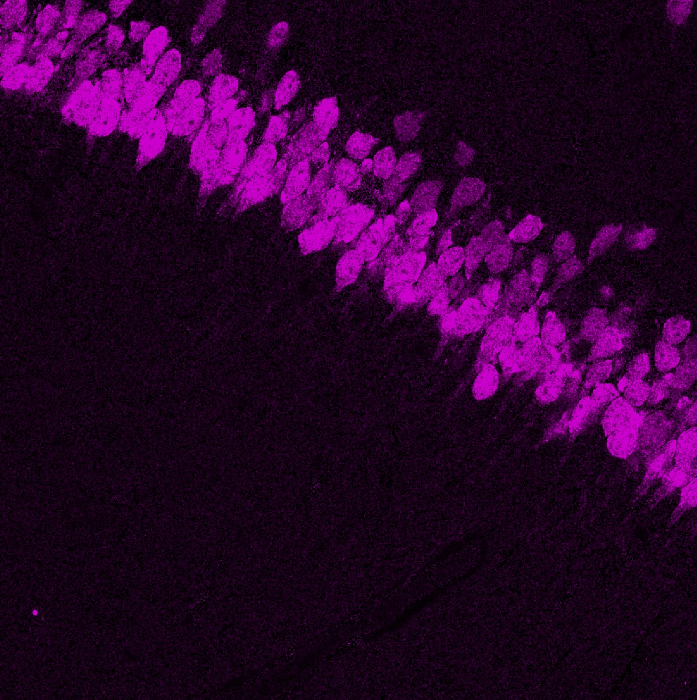

.. raw:: html

   

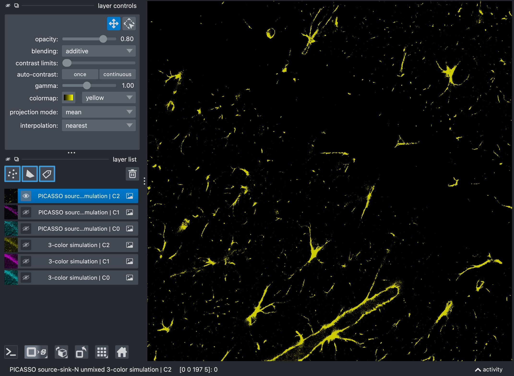

   This time, cross-talk was only successfully removed from the declared sink channel (channel 1). 
   The other two channels were left untouched, as requested. This is the expected behavior of the 
   source-sink-N formulation. The source-sink-N implementation is often the best choice when 
   you want one or more dedicated sink channels to be cleaned, leaving other channels untouched, while
   applying PICASSO-family blind unmixing logic to estimate the cross-talk coefficients.
